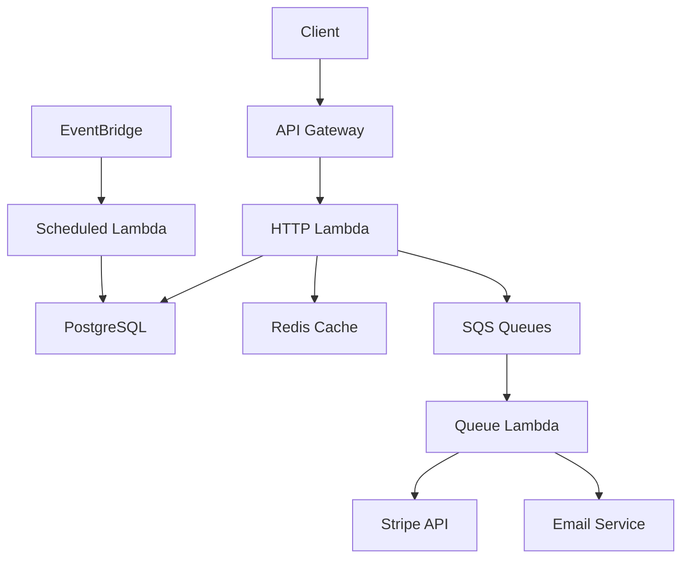

# Examples Gallery

> **Complete, production-ready applications** you can use as starting points or learning references

Browse working examples that demonstrate Transire best practices. Each example includes complete source code, architecture explanations, and deployment instructions.

---

## 🎯 Quick Start Examples

Perfect for learning Transire basics.

### Hello World

**What it does:** Simple HTTP API with GET endpoint

**Learn:**
- Basic app structure
- HTTP handler registration
- Response helpers

**Time:** 5 minutes

**[View Example →](hello-world/)**

```go
app.GET("/hello", func(w http.ResponseWriter, r *http.Request) {
    response.OK(w, map[string]string{
        "message": "Hello, World!",
    })
})
```

---

### REST API (Orders)

**What it does:** Complete CRUD API for managing orders

**Learn:**
- CRUD operations
- Input validation
- Error handling
- URL parameters
- Status codes

**Time:** 15 minutes

**[View Example →](orders.md)**

```go
app.GET("/orders", listOrders)
app.GET("/orders/{id}", getOrder)
app.POST("/orders", createOrder)
app.PUT("/orders/{id}", updateOrder)
app.DELETE("/orders/{id}", deleteOrder)
```

---

## 🚀 Intermediate Examples

Real-world applications with multiple features.

### Queue Processing System

**What it does:** Image processing pipeline with async queues

**Features:**
- File upload via HTTP
- Async image processing
- Batch processing
- Error handling with DLQ
- Progress tracking

**Stack:**
- HTTP handlers for upload
- Queue for processing
- S3 for storage (cloud)

**[View Example →](queue-processing/)**

**Architecture:**


---

### Scheduled Jobs System

**What it does:** Daily report generation and cleanup tasks

**Features:**
- Cron-based scheduling
- Report generation
- Email notifications
- Data cleanup
- Timezone handling

**Stack:**
- Scheduled handlers
- Database queries
- Email service integration

**[View Example →](scheduled-jobs/)**

```go
// Daily report at 9 AM
app.Schedule("daily-report", "@daily 09:00", generateReport)

// Cleanup old data every hour
app.Schedule("hourly-cleanup", "@hourly", cleanupOldData)
```

---

## 🏗️ Production Examples

Complete applications ready for production deployment.

### Full-Stack E-Commerce Backend

**What it does:** Complete backend for e-commerce application

**Features:**
- Product catalog API
- Order management
- Payment processing (Stripe)
- Inventory tracking
- Email notifications
- Admin dashboard

**Stack:**
- HTTP handlers (REST API)
- Queue handlers (order fulfillment, emails)
- Scheduled jobs (inventory sync, reports)
- PostgreSQL database
- Redis cache
- S3 file storage

**Architecture:**



**[View Example →](full-stack/)**

---

### Webhook Processing Service

**What it does:** Receives and processes webhooks from external services

**Features:**
- Webhook validation
- Async processing
- Retry logic
- Idempotency
- Event logging

**Use cases:**
- GitHub webhooks
- Stripe webhooks
- Shopify webhooks
- Custom integrations

**[View Example →](webhook-processor/)**

---

### Multi-Tenant SaaS API

**What it does:** Multi-tenant API with per-tenant isolation

**Features:**
- Tenant identification
- Per-tenant databases
- Usage tracking
- Rate limiting per tenant
- Tenant provisioning

**[View Example →](multi-tenant-saas/)**

---

## 📦 Patterns & Best Practices

Example implementations of common patterns.

### Middleware Examples

**Authentication:**
```go
func authMiddleware(next http.Handler) http.Handler {
    return http.HandlerFunc(func(w http.ResponseWriter, r *http.Request) {
        token := r.Header.Get("Authorization")
        if !validateToken(token) {
            response.Unauthorized(w, "Invalid token")
            return
        }
        next.ServeHTTP(w, r)
    })
}
```

**[View Full Example →](patterns/middleware/)**

---

### Dependency Injection Patterns

**Database connection:**
```go
transire.Provide(func(cfg *Config) (*sql.DB, error) {
    return sql.Open("postgres", cfg.DatabaseURL)
})
```

**Request-scoped services:**
```go
transire.ProvideRequest(func(ctx context.Context, r *http.Request) (*RequestID, error) {
    return &RequestID{ID: r.Header.Get("X-Request-ID")}, nil
})
```

**[View Full Example →](patterns/dependency-injection/)**

---

### Error Handling Patterns

**HTTP errors:**
```go
func handler(w http.ResponseWriter, r *http.Request) {
    user, err := fetchUser(id)
    if err != nil {
        if errors.Is(err, ErrNotFound) {
            response.NotFound(w, "User not found")
            return
        }
        response.InternalServerError(w, "Failed to fetch user")
        return
    }
    response.OK(w, user)
}
```

**[View Full Example →](patterns/error-handling/)**

---

## 🔄 Migration Examples

Examples for migrating from other frameworks.

### From AWS SAM

**Before (SAM):**
```yaml
# template.yaml
Resources:
  MyFunction:
    Type: AWS::Serverless::Function
    Properties:
      Handler: main
      Runtime: go1.x
      Events:
        Api:
          Type: Api
          Properties:
            Path: /hello
            Method: get
```

**After (Transire):**
```go
// main.go
app.GET("/hello", helloHandler)
```

**[View Migration Guide →](migration/from-aws-sam.md)**

---

### From Serverless Framework

**Before (Serverless):**
```yaml
# serverless.yml
functions:
  hello:
    handler: bin/hello
    events:
      - http:
          path: hello
          method: get
```

**After (Transire):**
```go
app.GET("/hello", helloHandler)
```

**[View Migration Guide →](migration/from-serverless-framework.md)**

---

### From Lambda Direct

**Before (Lambda):**
```go
func main() {
    lambda.Start(handleRequest)
}

func handleRequest(ctx context.Context, request events.APIGatewayProxyRequest) (events.APIGatewayProxyResponse, error) {
    // Complex event mapping...
}
```

**After (Transire):**
```go
func main() {
    app := transire.New()
    app.GET("/hello", helloHandler)
    app.Run()
}

func helloHandler(w http.ResponseWriter, r *http.Request) {
    response.OK(w, data)
}
```

**[View Migration Guide →](migration/from-lambda-direct.md)**

---

## 📚 By Feature

Browse examples by specific feature.

### HTTP Features

| Feature | Example |
|---------|---------|
| Basic routing | [Hello World](hello-world/) |
| CRUD operations | [Orders API](orders.md) |
| Path parameters | [Orders API](orders.md) |
| Query parameters | [Search API](patterns/query-params/) |
| File uploads | [Image Upload](patterns/file-upload/) |
| JSON validation | [Orders API](orders.md) |
| Authentication | [Auth Example](patterns/auth/) |
| Rate limiting | [Rate Limiter](patterns/rate-limit/) |

### Queue Features

| Feature | Example |
|---------|---------|
| Basic queue | [Queue Tutorial](../learn/tutorials/03-queue-processing.md) |
| Batch processing | [Image Processing](queue-processing/) |
| Partial failures | [Order Fulfillment](orders.md) |
| DLQ handling | [Webhook Processor](webhook-processor/) |
| Fan-out pattern | [Notification System](patterns/fan-out/) |

### Scheduled Features

| Feature | Example |
|---------|---------|
| Basic schedule | [Schedule Tutorial](../learn/tutorials/04-scheduled-jobs.md) |
| Cron expressions | [Scheduled Jobs](scheduled-jobs/) |
| Timezone handling | [Multi-Region Reports](patterns/timezones/) |
| Data cleanup | [Cleanup Jobs](patterns/cleanup/) |

### Dependency Injection

| Feature | Example |
|---------|---------|
| Singleton services | [Database Connection](patterns/di-singleton/) |
| Request-scoped | [Request Context](patterns/di-request/) |
| Config management | [Environment Config](patterns/config/) |

---

## 🎓 Learning Paths

Recommended order for exploring examples.

### Beginner Path

1. [Hello World](hello-world/) - 5 min
2. [Orders API](orders.md) - 15 min
3. [Queue Processing Tutorial](../learn/tutorials/03-queue-processing.md) - 20 min
4. [Scheduled Jobs Tutorial](../learn/tutorials/04-scheduled-jobs.md) - 15 min

**Total:** ~1 hour

---

### Intermediate Path

1. Complete Beginner Path
2. [Image Processing Pipeline](queue-processing/) - 30 min
3. [Webhook Processor](webhook-processor/) - 30 min
4. [Authentication Example](patterns/auth/) - 20 min
5. [DI Patterns](patterns/dependency-injection/) - 20 min

**Total:** ~2 hours

---

### Advanced Path

1. Complete Intermediate Path
2. [Full-Stack E-Commerce](full-stack/) - 2 hours
3. [Multi-Tenant SaaS](multi-tenant-saas/) - 1 hour
4. [Error Handling Patterns](patterns/error-handling/) - 30 min
5. [Performance Optimization](patterns/performance/) - 30 min

**Total:** ~4 hours

---

## 💾 Download Examples

All examples are available in the Transire repository:

```bash
# Clone repository
git clone https://github.com/transire/examples.git

# Navigate to example
cd examples/orders-api

# Run locally
go run main.go

# Deploy to cloud
transire deploy
```

---

## 🤝 Contributing Examples

Have a great example? We'd love to include it!

### Requirements

- ✅ Complete, runnable code
- ✅ README with setup instructions
- ✅ Comments explaining key concepts
- ✅ Tests included
- ✅ Works both locally and in cloud

### How to Contribute

1. Fork the [examples repository](https://github.com/transire/examples)
2. Add your example in a new directory
3. Include README.md with:
   - What it does
   - Key features
   - Setup instructions
   - Architecture diagram
4. Submit pull request

**[View Contributing Guide →](../community/contributing.md)**

---

## 🔍 Can't Find What You Need?

- **Ask in Discussions:** [GitHub Discussions](https://github.com/transire/transire/discussions)
- **Request an Example:** [Open an issue](https://github.com/transire/examples/issues/new)
- **Check Guides:** [Guides section](../guides/)
- **Read Tutorials:** [Learning path](../learn/curriculum/beginner-path.md)

---

## 📖 Related Resources

- [Quick Start Guide](../getting-started/quickstart.md) - 15-minute tutorial
- [Beginner Learning Path](../learn/curriculum/beginner-path.md) - Structured curriculum
- [API Reference](../reference/sdk/overview/) - Complete API docs
- [Troubleshooting](../guides/troubleshooting/) - Common issues

---

## Tags

Popular tags for filtering examples:

`http` `rest-api` `crud` `queue` `async` `scheduled` `cron` `database` `postgres` `redis` `auth` `jwt` `middleware` `di` `error-handling` `testing` `deployment` `production` `migration` `aws` `lambda` `sqs` `eventbridge`

---

**Can't find what you're looking for?** [Request an example →](https://github.com/transire/examples/issues/new)
