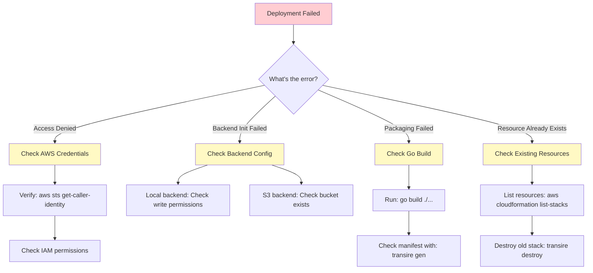
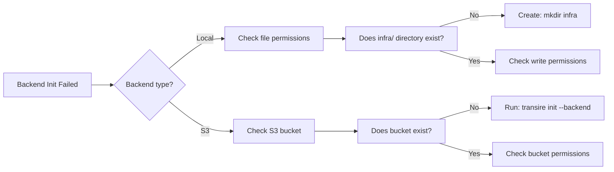
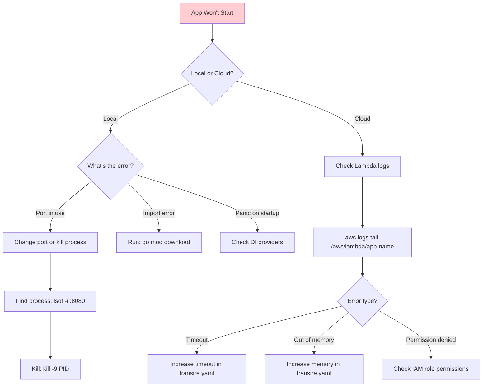
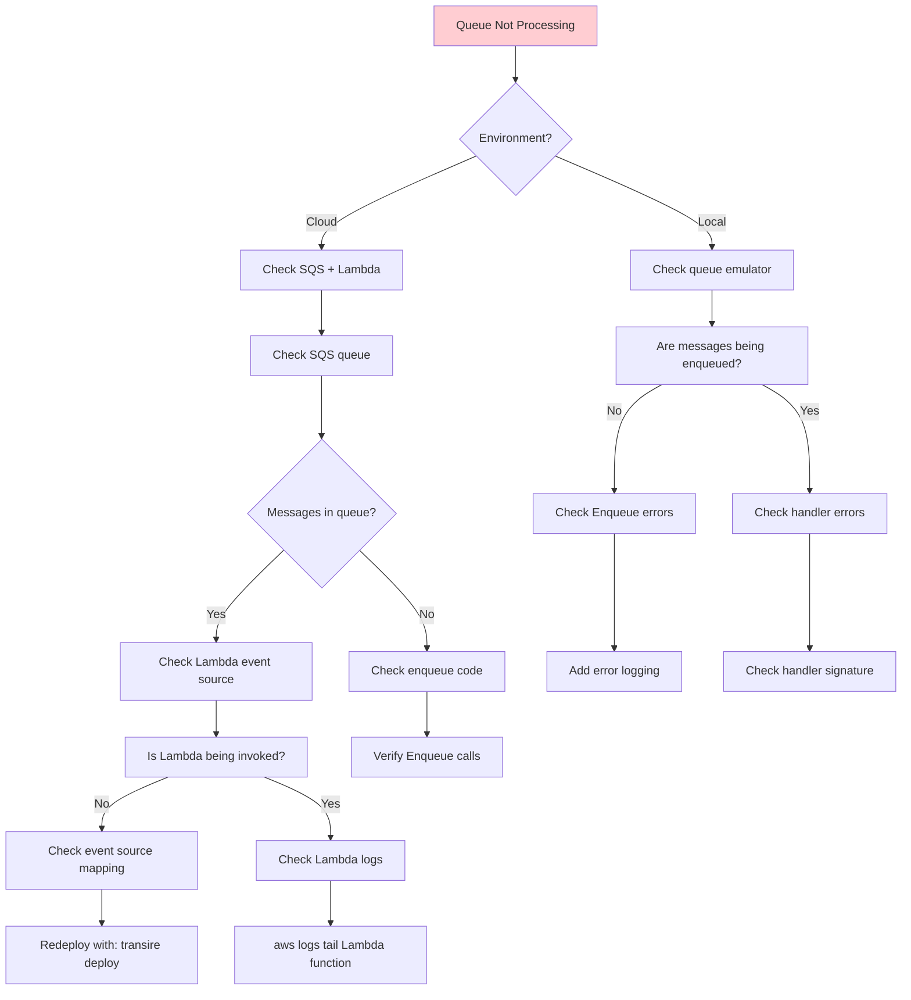
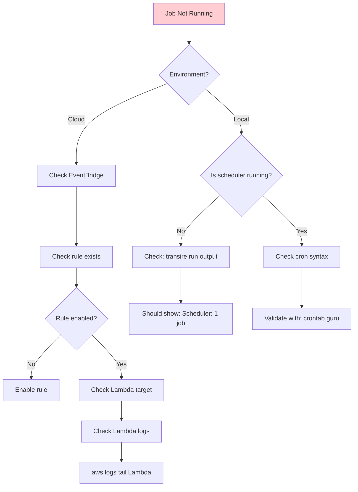
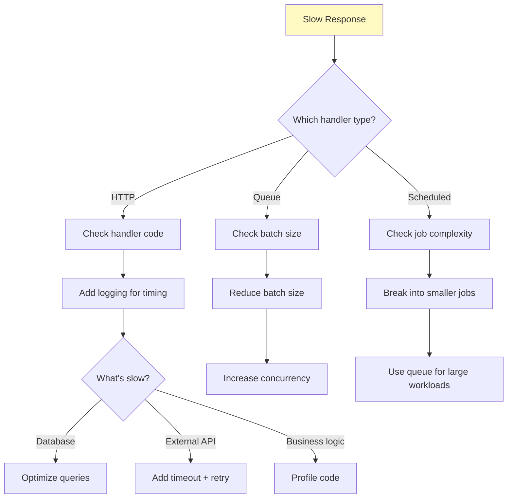

# Troubleshooting Guide

> **Quick help:** Use the decision trees below to diagnose and solve common issues

Having trouble? This guide provides systematic diagnostic flows and solutions for common Transire issues.

---

## Quick Diagnostics

**Choose your problem area:**

<div class="grid cards" markdown>

-   :material-cloud-alert:{ .lg .middle } **Deployment Issues**

    ---

    Problems with `transire deploy`, AWS resources, or infrastructure

    [:octicons-arrow-right-24: Deployment Diagnostics](#deployment-issues)

-   :material-run-fast:{ .lg .middle } **Runtime Issues**

    ---

    Problems with running app locally or in cloud

    [:octicons-arrow-right-24: Runtime Diagnostics](#runtime-issues)

-   :material-message-processing:{ .lg .middle } **Queue Issues**

    ---

    Messages not processing, stuck, or failing

    [:octicons-arrow-right-24: Queue Diagnostics](#queue-issues)

-   :material-clock-alert:{ .lg .middle } **Schedule Issues**

    ---

    Scheduled jobs not running or running incorrectly

    [:octicons-arrow-right-24: Schedule Diagnostics](#schedule-issues)

</div>

---

## Deployment Issues

### Decision Tree: Deployment Failed



### Deployment: Access Denied {#deployment-access-denied}

**Error message:**

```
Error: AccessDenied: User is not authorized to perform: lambda:CreateFunction
```

**Cause:** AWS credentials don't have sufficient permissions.

**Solution:**

1. **Verify AWS credentials are configured:**

    ```bash
    $ aws sts get-caller-identity
    ```

    Expected: Your AWS account ID and user ARN

2. **Check IAM permissions:**

    Your IAM user/role needs these permissions:

    ```json
    {
      "Version": "2012-10-17",
      "Statement": [
        {
          "Effect": "Allow",
          "Action": [
            "lambda:*",
            "apigateway:*",
            "sqs:*",
            "events:*",
            "iam:CreateRole",
            "iam:AttachRolePolicy",
            "iam:PassRole",
            "s3:*",
            "cloudformation:*"
          ],
          "Resource": "*"
        }
      ]
    }
    ```

3. **For production:** Use a dedicated deployment role with least-privilege permissions

**See also:** [AWS Permissions Guide](../../plugins/cloud/aws/permissions/)

---

### Deployment: Backend Initialization Failed {#deployment-backend-init}

**Error message:**

```
Error: Failed to initialize backend: permission denied
```

**Cause:** Cannot write to backend storage location.

**Diagnosis:**



**Solution for local backend:**

```bash
# Create infra directory if it doesn't exist
mkdir -p infra

# Check you have write permissions
ls -la infra/

# If needed, fix permissions
chmod 755 infra/
```

**Solution for S3 backend:**

```bash
# Check if bucket exists
aws s3 ls s3://your-bucket-name

# If not, initialize backend
transire init --backend

# Verify bucket was created
aws s3 ls s3://your-bucket-name
```

**See also:** [Backend Setup Guide](../../plugins/iac/opentofu/backend-setup/)

---

### Deployment: Function Packaging Failed {#deployment-packaging}

**Error message:**

```
Error: Failed to package handler: build failed
```

**Cause:** Go build errors or invalid manifest.

**Diagnosis steps:**

1. **Test Go build locally:**

    ```bash
    $ go build ./...
    ```

    Fix any compilation errors.

2. **Validate manifest:**

    ```bash
    $ transire gen
    ```

    Look for validation errors (E1001-E1007).

3. **Common issues:**

    | Error Code | Issue | Solution |
    |------------|-------|----------|
    | E1001 | Handler function not found | Check function name matches registration |
    | E1002 | Invalid handler signature | Fix function signature |
    | E1003 | Duplicate route | Remove duplicate `app.GET()` calls |
    | E1005 | Cannot infer queue message type | Use concrete type, not interface |

**See also:** [Error Codes Reference](../../reference/error-codes/)

---

## Runtime Issues

### Decision Tree: App Won't Start



### Runtime: Port Already in Use

**Error message:**

```
Error: listen tcp :8080: bind: address already in use
```

**Solution:**

1. **Find the process using port 8080:**

    ```bash
    $ lsof -i :8080
    COMMAND   PID   USER
    main      1234  user
    ```

2. **Kill the process:**

    ```bash
    $ kill -9 1234
    ```

3. **Or change the port in `transire.yaml`:**

    ```yaml
    http:
      port: 8081  # Use different port
    ```

---

### Runtime: Dependency Injection Panic

**Error message:**

```
panic: dependency not found: *OrderService
```

**Cause:** Service not registered with `transire.Provide()`.

**Solution:**

1. **Ensure service is provided before `app.Run()`:**

    ```go
    func main() {
        // Provide MUST come before app.Run()
        transire.Provide(func() (*OrderService, error) {
            return &OrderService{}, nil
        })

        app := transire.New()
        // ... register handlers
        app.Run()
    }
    ```

2. **Check provider signature:**

    ```go
    // ✅ Correct - returns (*T, error)
    transire.Provide(func() (*OrderService, error) {
        return &OrderService{}, nil
    })

    // ❌ Wrong - missing error return
    transire.Provide(func() *OrderService {
        return &OrderService{}
    })
    ```

**See also:** [Dependency Injection Guide](../../reference/sdk/di-api/)

---

## Queue Issues

### Decision Tree: Queue Not Processing



### Queue: Messages Not Processing {#queue-stuck-messages}

**Symptom:** Messages enqueued but handler never invoked.

**Diagnosis for local:**

1. **Check emulator is running:**

    ```bash
    $ transire run
    ✓ Queue emulator: 1 queue (process-orders), 1 worker
    ```

2. **Verify messages are being enqueued:**

    Add logging:

    ```go
    func createOrder(w http.ResponseWriter, r *http.Request) {
        // ... create order

        err := app.Enqueue(r.Context(), "process-orders", order)
        if err != nil {
            log.Printf("ERROR: Failed to enqueue: %v", err)  // Add this
            return
        }
        log.Printf("INFO: Enqueued order %s", order.ID)  // And this
    }
    ```

3. **Check handler errors:**

    ```go
    func processOrders(ctx context.Context, orders []Order) error {
        log.Printf("Processing %d orders", len(orders))  // Add logging

        for _, order := range orders {
            if err := process(order); err != nil {
                log.Printf("ERROR processing order %s: %v", order.ID, err)
                return err  // This stops processing!
            }
        }
        return nil
    }
    ```

**Diagnosis for cloud:**

1. **Check SQS queue:**

    ```bash
    $ aws sqs get-queue-attributes \
        --queue-url $(aws sqs get-queue-url --queue-name app-dev-queue --query 'QueueUrl' --output text) \
        --attribute-names ApproximateNumberOfMessages

    {
        "Attributes": {
            "ApproximateNumberOfMessages": "42"  # Messages stuck!
        }
    }
    ```

2. **Check Lambda function exists:**

    ```bash
    $ aws lambda list-functions --query 'Functions[?starts_with(FunctionName, `app-dev-queue`)].FunctionName'
    ```

3. **Check event source mapping:**

    ```bash
    $ aws lambda list-event-source-mappings \
        --function-name app-dev-queue-process-orders

    # Should show: "State": "Enabled"
    ```

4. **Check Lambda logs:**

    ```bash
    $ aws logs tail /aws/lambda/app-dev-queue-process-orders --follow
    ```

**Solution:** If event source mapping missing, redeploy:

```bash
$ transire deploy --environment=dev
```

---

### Queue: Messages Going to DLQ {#queue-messages-dlq}

**Symptom:** All messages end up in dead-letter queue.

**Cause:** Handler is returning errors for all messages.

**Diagnosis:**

```bash
# Check DLQ
$ aws sqs get-queue-attributes \
    --queue-url $(aws sqs get-queue-url --queue-name app-dev-queue-dlq --query 'QueueUrl' --output text) \
    --attribute-names ApproximateNumberOfMessages
```

**Solution:**

1. **Check Lambda logs for errors:**

    ```bash
    $ aws logs tail /aws/lambda/app-dev-queue-handler --follow
    ```

2. **Common causes:**

    | Error | Cause | Fix |
    |-------|-------|-----|
    | Type mismatch | Message `__type` doesn't match handler | Check enqueue type matches handler type |
    | JSON unmarshal error | Invalid message format | Validate message structure |
    | Handler panic | Uncaught panic in handler | Add error handling |
    | Dependency error | DI service unavailable | Check service initialization |

3. **Inspect DLQ messages:**

    ```bash
    $ aws sqs receive-message \
        --queue-url $(aws sqs get-queue-url --queue-name app-dev-queue-dlq --query 'QueueUrl' --output text) \
        --max-number-of-messages 1
    ```

**See also:** [Queue Error Handling](../../reference/sdk/queue-api/#error-handling)

---

## Schedule Issues

### Decision Tree: Scheduled Job Not Running



### Schedule: Job Not Running in Cloud

**Symptom:** Scheduled job not executing at expected time.

**Diagnosis:**

1. **Check EventBridge rule:**

    ```bash
    $ aws events list-rules --name-prefix app-dev-
    ```

    Look for your scheduled job rule.

2. **Check rule is enabled:**

    ```bash
    $ aws events describe-rule --name app-dev-daily-report
    {
        "State": "ENABLED",  # Should be ENABLED
        "ScheduleExpression": "cron(0 9 * * ? *)"
    }
    ```

3. **Check rule has Lambda target:**

    ```bash
    $ aws events list-targets-by-rule --rule app-dev-daily-report
    ```

    Should show your Lambda function ARN.

4. **Check Lambda logs:**

    ```bash
    $ aws logs tail /aws/lambda/app-dev-scheduled-daily-report --follow
    ```

**Solution:** If rule disabled or target missing, redeploy:

```bash
$ transire deploy --environment=dev
```

---

### Schedule: Wrong Time Zone

**Symptom:** Job runs at wrong time.

**Cause:** Timezone mismatch between config and expectation.

**Solution:**

1. **Check timezone in `transire.yaml`:**

    ```yaml
    timezone: America/New_York  # Must match your expected timezone
    ```

2. **Cron expressions use UTC by default:**

    ```yaml
    # This runs at 9 AM UTC (not your local time!)
    app.Schedule("report", "cron(0 9 * * ? *)", handler)
    ```

3. **Use `@daily` shorthand for timezone-aware schedules:**

    ```yaml
    # This uses the timezone from transire.yaml
    app.Schedule("report", "@daily 09:00", handler)
    ```

4. **Or specify timezone explicitly:**

    ```yaml
    app.Schedule("report", "@daily 09:00 America/New_York", handler)
    ```

**See also:** [Schedule Reference](../../reference/sdk/schedule-api/#timezone-handling)

---

## Performance Issues

### Decision Tree: Slow Response Times



### HTTP: Slow Response Times

**Symptom:** API requests taking > 1 second.

**Diagnosis:**

1. **Add timing logs:**

    ```go
    func getOrders(w http.ResponseWriter, r *http.Request) {
        start := time.Now()
        defer func() {
            log.Printf("getOrders took %v", time.Since(start))
        }()

        // Your code here
    }
    ```

2. **Profile hot paths:**

    ```go
    import _ "net/http/pprof"

    // Access profiler at http://localhost:8080/debug/pprof/
    ```

**Common causes and solutions:**

| Cause | Solution |
|-------|----------|
| **N+1 database queries** | Use `SELECT ... WHERE IN` or JOIN |
| **No database indexes** | Add indexes on frequently queried columns |
| **Blocking external API** | Use timeouts and consider async with queues |
| **Large response payloads** | Implement pagination |
| **No caching** | Add caching layer (Redis, in-memory) |

**See also:** [Performance Guide](../performance/)

---

## Getting More Help

### Check Logs

**Local:**

```bash
# Logs go to stdout
$ transire run
```

**Cloud:**

```bash
# HTTP handler logs
$ aws logs tail /aws/lambda/app-dev-http --follow

# Queue handler logs
$ aws logs tail /aws/lambda/app-dev-queue-handler --follow

# Scheduled job logs
$ aws logs tail /aws/lambda/app-dev-scheduled-job --follow
```

### Enable Debug Logging

Add to `transire.yaml`:

```yaml
observability:
  logging:
    level: debug  # Shows detailed debug information
    format: json
```

### Inspect Generated Resources

**View manifest:**

```bash
$ cat transire_manifest.json | jq
```

**View OpenTofu plan:**

```bash
$ cd infra
$ tofu plan
```

### Community Support

- **[GitHub Discussions](https://github.com/transire/transire/discussions)** - Ask questions
- **[GitHub Issues](https://github.com/transire/transire/issues)** - Report bugs
- **[FAQ](../../community/faq/)** - Common questions

---

## Related Guides

- [Deployment Guide](../deployment/first-deployment/) - How to deploy successfully
- [Error Codes Reference](../../reference/error-codes/) - All error codes explained
- [AWS Troubleshooting](../../plugins/cloud/aws/troubleshooting/) - AWS-specific issues
- [Performance Guide](../performance/) - Optimize your application
