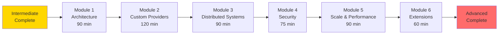

# Advanced Learning Path

> **Expert Level:** Architect scalable systems and extend Transire

## Your Journey



**Total Time:** 6-8 hours
**Outcome:** Expert-level mastery

---

## What You'll Master

After completing this path, you'll be able to:

- ✅ Architect complex distributed systems
- ✅ Create custom cloud providers
- ✅ Build plugin systems
- ✅ Design for extreme scale
- ✅ Implement advanced security patterns
- ✅ Extend Transire framework
- ✅ Optimize at infrastructure level
- ✅ Lead technical architecture

---

## Prerequisites

Before starting, ensure you've completed:

- [x] Intermediate Learning Path (all 6 modules)
- [x] 2+ months production experience with Transire
- [x] Deployed multiple applications
- [x] Comfortable with Go internals
- [x] Understanding of distributed systems

**If not:** Complete the [Intermediate Path](intermediate-path.md)

---

## Module 1: System Architecture

**Time:** 90 minutes
**Complexity:** Advanced

### What You'll Learn

- Event-driven architecture
- CQRS and Event Sourcing
- Saga pattern for distributed transactions
- API Gateway patterns
- Service mesh integration
- Microservices decomposition

### Topics

#### Event-Driven Architecture

```go
// Event bus for decoupling services
type EventBus interface {
    Publish(ctx context.Context, event Event) error
    Subscribe(eventType string, handler EventHandler) error
}

type Event struct {
    ID        string                 `json:"id"`
    Type      string                 `json:"type"`
    Timestamp time.Time              `json:"timestamp"`
    Data      map[string]interface{} `json:"data"`
}

// Order service publishes events
func createOrder(w http.ResponseWriter, r *http.Request, db *Database, bus EventBus) {
    order := &Order{...}
    if err := db.CreateOrder(r.Context(), order); err != nil {
        response.InternalServerError(w, "Failed")
        return
    }

    // Publish OrderCreated event
    bus.Publish(r.Context(), Event{
        ID:        uuid.New().String(),
        Type:      "OrderCreated",
        Timestamp: time.Now(),
        Data: map[string]interface{}{
            "order_id": order.ID,
            "user_id":  order.UserID,
            "total":    order.Total,
        },
    })

    response.Created(w, order)
}

// Inventory service subscribes to events
func main() {
    app := transire.New()

    bus := NewEventBus()

    // Subscribe to OrderCreated
    bus.Subscribe("OrderCreated", func(ctx context.Context, event Event) error {
        orderID := event.Data["order_id"].(string)
        return reserveInventory(ctx, orderID)
    })

    // Subscribe via queue
    app.RegisterQueue("order-events", handleOrderEvents)

    app.Run()
}
```

#### CQRS Pattern

```go
// Command: Write model
type CreateOrderCommand struct {
    UserID   string
    Products []OrderItem
}

type CommandHandler struct {
    db        *Database
    eventBus  EventBus
}

func (h *CommandHandler) Handle(ctx context.Context, cmd CreateOrderCommand) (*Order, error) {
    // Validate
    if err := h.validate(cmd); err != nil {
        return nil, err
    }

    // Write to database
    order := &Order{
        ID:     generateID(),
        UserID: cmd.UserID,
        Items:  cmd.Products,
        Status: "pending",
    }

    if err := h.db.CreateOrder(ctx, order); err != nil {
        return nil, err
    }

    // Publish event
    h.eventBus.Publish(ctx, OrderCreatedEvent{OrderID: order.ID})

    return order, nil
}

// Query: Read model
type OrderQueryService struct {
    readDB *ReadDatabase  // Optimized read replica
    cache  *Cache
}

func (q *OrderQueryService) GetOrders(ctx context.Context, userID string) ([]OrderDTO, error) {
    // Check cache
    if cached, err := q.cache.Get(ctx, "orders:"+userID); err == nil {
        return cached.([]OrderDTO), nil
    }

    // Query read model (denormalized)
    orders, err := q.readDB.Query(ctx, `
        SELECT o.id, o.total, o.status, o.created_at,
               u.name, u.email,
               json_agg(i.*) as items
        FROM orders o
        JOIN users u ON o.user_id = u.id
        JOIN order_items i ON i.order_id = o.id
        WHERE o.user_id = $1
        GROUP BY o.id, u.name, u.email
    `, userID)

    // Cache result
    q.cache.Set(ctx, "orders:"+userID, orders, 5*time.Minute)

    return orders, err
}
```

#### Saga Pattern

```go
// Distributed transaction coordinator
type OrderSaga struct {
    db           *Database
    paymentSvc   *PaymentService
    inventorySvc *InventoryService
    shippingSvc  *ShippingService
}

func (s *OrderSaga) Execute(ctx context.Context, order *Order) error {
    // Step 1: Reserve inventory
    if err := s.inventorySvc.Reserve(ctx, order.Items); err != nil {
        return fmt.Errorf("inventory reservation failed: %w", err)
    }

    // Step 2: Process payment
    if err := s.paymentSvc.Charge(ctx, order.Total); err != nil {
        // Compensate: Release inventory
        s.inventorySvc.Release(ctx, order.Items)
        return fmt.Errorf("payment failed: %w", err)
    }

    // Step 3: Create shipment
    if err := s.shippingSvc.Create(ctx, order); err != nil {
        // Compensate: Refund payment and release inventory
        s.paymentSvc.Refund(ctx, order.Total)
        s.inventorySvc.Release(ctx, order.Items)
        return fmt.Errorf("shipment creation failed: %w", err)
    }

    // Success: Update order status
    order.Status = "processing"
    return s.db.UpdateOrder(ctx, order)
}
```

#### API Gateway Pattern

```go
// Aggregator gateway
type OrderGateway struct {
    orderSvc    *OrderService
    userSvc     *UserService
    inventorySvc *InventoryService
}

// Aggregate data from multiple services
func (g *OrderGateway) GetOrderDetails(ctx context.Context, orderID string) (*OrderDetails, error) {
    // Parallel calls with context
    type result struct {
        order     *Order
        user      *User
        inventory []InventoryItem
        err       error
    }

    results := make(chan result, 3)

    // Fetch order
    go func() {
        order, err := g.orderSvc.GetOrder(ctx, orderID)
        results <- result{order: order, err: err}
    }()

    // Fetch user
    go func() {
        order, _ := g.orderSvc.GetOrder(ctx, orderID)
        user, err := g.userSvc.GetUser(ctx, order.UserID)
        results <- result{user: user, err: err}
    }()

    // Fetch inventory
    go func() {
        order, _ := g.orderSvc.GetOrder(ctx, orderID)
        inventory, err := g.inventorySvc.CheckStock(ctx, order.Items)
        results <- result{inventory: inventory, err: err}
    }()

    // Collect results
    var r result
    for i := 0; i < 3; i++ {
        select {
        case res := <-results:
            if res.err != nil {
                return nil, res.err
            }
            if res.order != nil {
                r.order = res.order
            }
            if res.user != nil {
                r.user = res.user
            }
            if res.inventory != nil {
                r.inventory = res.inventory
            }
        case <-ctx.Done():
            return nil, ctx.Err()
        }
    }

    return &OrderDetails{
        Order:     r.order,
        User:      r.user,
        Inventory: r.inventory,
    }, nil
}
```

### Hands-On Exercise

**Task:** Design and implement an event-driven system

1. Design event-driven architecture for e-commerce
2. Implement CQRS for order management
3. Create saga for distributed transactions
4. Build API gateway aggregator
5. Document system architecture

### Learning Check

- [ ] Can design event-driven systems
- [ ] Can implement CQRS pattern
- [ ] Can coordinate distributed transactions
- [ ] Can build API gateways
- [ ] Understand microservices patterns

### Resources

- [Event-Driven Architecture Guide](../../guides/architecture/event-driven/)
- [CQRS Pattern](../../guides/patterns/cqrs/)
- [Martin Fowler - CQRS](https://martinfowler.com/bliki/CQRS.html)

**Time to complete:** 90 minutes

---

## Module 2: Custom Cloud Providers

**Time:** 120 minutes
**Complexity:** Advanced

### What You'll Learn

- Provider contract interface
- Event adaptation (HTTP, Queue, Schedule)
- Infrastructure generation
- Provider packaging
- Testing custom providers
- Publishing providers

### Topics

#### Provider Interface

```go
// github.com/transire/sdk-go/provider
package provider

type CloudProvider interface {
    // Runtime detection
    IsRunningInCloud() bool
    ProviderName() string

    // HTTP handling
    AdaptHTTPEvent(cloudEvent interface{}) (*HTTPRequest, error)
    AdaptHTTPResponse(resp *HTTPResponse) interface{}

    // Queue handling
    AdaptQueueEvent(cloudEvent interface{}) ([]Message, error)
    ReportPartialBatchFailure(failures []int) interface{}

    // Schedule handling
    AdaptScheduleEvent(cloudEvent interface{}) error

    // Deployment
    PackageHandler(manifest *Manifest, handlerType HandlerType) ([]Artifact, error)
    GenerateInfrastructure(manifest *Manifest) (string, error)
}
```

#### Example: DigitalOcean Provider

```go
// github.com/transire/cloud-digitalocean
package digitalocean

import (
    "os"
    "github.com/transire/sdk-go/provider"
)

type Provider struct{}

func (p *Provider) IsRunningInCloud() bool {
    return os.Getenv("DO_FUNCTIONS_RUNTIME") != ""
}

func (p *Provider) ProviderName() string {
    return "digitalocean"
}

// HTTP event adaptation
func (p *Provider) AdaptHTTPEvent(cloudEvent interface{}) (*provider.HTTPRequest, error) {
    // DigitalOcean Functions event format
    event := cloudEvent.(map[string]interface{})

    return &provider.HTTPRequest{
        Method: event["http"].(map[string]interface{})["method"].(string),
        Path:   event["http"].(map[string]interface{})["path"].(string),
        Headers: convertHeaders(event["http"].(map[string]interface{})["headers"]),
        Body:    []byte(event["http"].(map[string]interface{})["body"].(string)),
    }, nil
}

func (p *Provider) AdaptHTTPResponse(resp *provider.HTTPResponse) interface{} {
    return map[string]interface{}{
        "statusCode": resp.StatusCode,
        "headers":    resp.Headers,
        "body":       string(resp.Body),
    }
}

// Queue event adaptation
func (p *Provider) AdaptQueueEvent(cloudEvent interface{}) ([]provider.Message, error) {
    // DigitalOcean doesn't have native queue - use external service
    // Or integrate with Kafka, RabbitMQ, etc.
    return nil, errors.New("queues not supported on DigitalOcean")
}

// Infrastructure generation
func (p *Provider) GenerateInfrastructure(manifest *provider.Manifest) (string, error) {
    // Generate DigitalOcean Functions YAML
    yaml := `
name: ` + manifest.Service + `
runtime: go1.21

functions:
  - name: http
    handler: main
    events:
      - http:
          path: /
          method: ANY
    env:
      ` + generateEnvVars(manifest) + `
`
    return yaml, nil
}

// Package handler for DigitalOcean
func (p *Provider) PackageHandler(manifest *provider.Manifest, handlerType provider.HandlerType) ([]provider.Artifact, error) {
    // Build binary
    cmd := exec.Command("go", "build", "-o", "handler", "./cmd/handler")
    if err := cmd.Run(); err != nil {
        return nil, err
    }

    // Create zip
    zip := createZip("handler", manifest.Dependencies)

    return []provider.Artifact{
        {
            Name: handlerType + ".zip",
            Data: zip,
            Type: "function",
        },
    }, nil
}

// Register provider
func init() {
    provider.Register("digitalocean", &Provider{})
}
```

#### Testing Custom Provider

```go
package digitalocean

import (
    "testing"
    "github.com/transire/sdk-go/provider"
)

func TestHTTPAdaptation(t *testing.T) {
    p := &Provider{}

    // Create test event
    event := map[string]interface{}{
        "http": map[string]interface{}{
            "method": "GET",
            "path":   "/orders",
            "headers": map[string]string{
                "Content-Type": "application/json",
            },
            "body": "",
        },
    }

    // Adapt event
    req, err := p.AdaptHTTPEvent(event)
    if err != nil {
        t.Fatalf("Failed to adapt event: %v", err)
    }

    // Assert
    if req.Method != "GET" {
        t.Errorf("Expected GET, got %s", req.Method)
    }
    if req.Path != "/orders" {
        t.Errorf("Expected /orders, got %s", req.Path)
    }
}

func TestInfraGeneration(t *testing.T) {
    p := &Provider{}

    manifest := &provider.Manifest{
        Service: "orders-api",
        Handlers: provider.Handlers{
            HTTP: []provider.HTTPHandler{
                {Method: "GET", Path: "/orders"},
            },
        },
    }

    yaml, err := p.GenerateInfrastructure(manifest)
    if err != nil {
        t.Fatalf("Failed to generate infrastructure: %v", err)
    }

    if !strings.Contains(yaml, "name: orders-api") {
        t.Error("Generated YAML missing service name")
    }
}
```

### Hands-On Exercise

**Task:** Create a custom cloud provider

1. Choose a cloud platform (Cloudflare, Azure, etc.)
2. Implement provider interface
3. Add HTTP event adaptation
4. Generate infrastructure code
5. Test provider thoroughly
6. Document provider usage

### Learning Check

- [ ] Can implement provider interface
- [ ] Can adapt cloud events
- [ ] Can generate infrastructure
- [ ] Can package handlers
- [ ] Can test custom providers

### Resources

- [Creating Providers Guide](../../plugins/cloud/creating-providers/)
- [Provider API Reference](../../reference/providers/api/)

**Time to complete:** 120 minutes

---

## Module 3: Distributed Systems Patterns

**Time:** 90 minutes
**Complexity:** Advanced

### What You'll Learn

- Circuit breaker pattern
- Rate limiting strategies
- Distributed caching
- Message deduplication
- Retry with exponential backoff
- Bulkhead pattern

### Topics

#### Circuit Breaker

```go
type CircuitBreaker struct {
    maxFailures  int
    resetTimeout time.Duration
    state        State
    failures     int
    lastFailTime time.Time
    mu           sync.RWMutex
}

type State int

const (
    StateClosed State = iota
    StateOpen
    StateHalfOpen
)

func (cb *CircuitBreaker) Call(fn func() error) error {
    cb.mu.RLock()
    state := cb.state
    cb.mu.RUnlock()

    switch state {
    case StateOpen:
        // Check if should try again
        if time.Since(cb.lastFailTime) > cb.resetTimeout {
            cb.mu.Lock()
            cb.state = StateHalfOpen
            cb.mu.Unlock()
        } else {
            return errors.New("circuit breaker open")
        }

    case StateHalfOpen:
        // Try request
        if err := fn(); err != nil {
            cb.recordFailure()
            return err
        }
        cb.recordSuccess()
        return nil
    }

    // Closed state - normal operation
    if err := fn(); err != nil {
        cb.recordFailure()
        return err
    }

    cb.recordSuccess()
    return nil
}

func (cb *CircuitBreaker) recordFailure() {
    cb.mu.Lock()
    defer cb.mu.Unlock()

    cb.failures++
    cb.lastFailTime = time.Now()

    if cb.failures >= cb.maxFailures {
        cb.state = StateOpen
        log.Printf("Circuit breaker opened after %d failures", cb.failures)
    }
}

func (cb *CircuitBreaker) recordSuccess() {
    cb.mu.Lock()
    defer cb.mu.Unlock()

    cb.failures = 0
    if cb.state == StateHalfOpen {
        cb.state = StateClosed
        log.Println("Circuit breaker closed")
    }
}
```

#### Distributed Rate Limiting

```go
import "github.com/go-redis/redis/v8"

type DistributedRateLimiter struct {
    redis  *redis.Client
    limit  int
    window time.Duration
}

func (rl *DistributedRateLimiter) Allow(ctx context.Context, key string) (bool, error) {
    now := time.Now().Unix()
    windowStart := now - int64(rl.window.Seconds())

    pipe := rl.redis.Pipeline()

    // Remove old entries
    pipe.ZRemRangeByScore(ctx, key, "0", fmt.Sprintf("%d", windowStart))

    // Count current window
    pipe.ZCard(ctx, key)

    // Add current request
    pipe.ZAdd(ctx, key, &redis.Z{
        Score:  float64(now),
        Member: fmt.Sprintf("%d", now),
    })

    // Set expiration
    pipe.Expire(ctx, key, rl.window)

    cmds, err := pipe.Exec(ctx)
    if err != nil {
        return false, err
    }

    count := cmds[1].(*redis.IntCmd).Val()

    return count < int64(rl.limit), nil
}

// Usage in middleware
func RateLimitMiddleware(limiter *DistributedRateLimiter) func(http.Handler) http.Handler {
    return func(next http.Handler) http.Handler {
        return http.HandlerFunc(func(w http.ResponseWriter, r *http.Request) {
            userID := getUserID(r)

            allowed, err := limiter.Allow(r.Context(), "ratelimit:"+userID)
            if err != nil {
                response.InternalServerError(w, "Rate limit check failed")
                return
            }

            if !allowed {
                response.TooManyRequests(w, "Rate limit exceeded")
                return
            }

            next.ServeHTTP(w, r)
        })
    }
}
```

#### Message Deduplication

```go
type DeduplicationService struct {
    redis *redis.Client
    ttl   time.Duration
}

func (d *DeduplicationService) IsProcessed(ctx context.Context, messageID string) (bool, error) {
    key := "processed:" + messageID

    // Try to set key with NX (only if not exists)
    result, err := d.redis.SetNX(ctx, key, "1", d.ttl).Result()
    if err != nil {
        return false, err
    }

    // If result is false, key already existed (message already processed)
    return !result, nil
}

// Usage in queue handler
func processOrders(ctx context.Context, orders []Order, dedup *DeduplicationService) error {
    br := transire.NewBatchResult(len(orders))

    for i, order := range orders {
        // Check if already processed
        processed, err := dedup.IsProcessed(ctx, order.ID)
        if err != nil {
            br.Fail(i, err)
            continue
        }

        if processed {
            log.Printf("Order %s already processed, skipping", order.ID)
            continue
        }

        // Process order
        if err := fulfillOrder(ctx, &order); err != nil {
            br.Fail(i, err)
            continue
        }
    }

    return br.ToCloudPartialBatchResponse()
}
```

#### Retry with Exponential Backoff

```go
type RetryConfig struct {
    MaxRetries     int
    InitialDelay   time.Duration
    MaxDelay       time.Duration
    Multiplier     float64
    RetryableErrors []error
}

func RetryWithBackoff(ctx context.Context, config RetryConfig, fn func() error) error {
    var lastErr error
    delay := config.InitialDelay

    for attempt := 0; attempt <= config.MaxRetries; attempt++ {
        // Try operation
        err := fn()
        if err == nil {
            return nil
        }

        lastErr = err

        // Check if error is retryable
        retryable := false
        for _, retryErr := range config.RetryableErrors {
            if errors.Is(err, retryErr) {
                retryable = true
                break
            }
        }

        if !retryable {
            return err
        }

        // Last attempt failed
        if attempt == config.MaxRetries {
            break
        }

        // Wait with exponential backoff
        select {
        case <-time.After(delay):
            delay = time.Duration(float64(delay) * config.Multiplier)
            if delay > config.MaxDelay {
                delay = config.MaxDelay
            }
        case <-ctx.Done():
            return ctx.Err()
        }

        log.Printf("Retry attempt %d after %v", attempt+1, delay)
    }

    return fmt.Errorf("max retries exceeded: %w", lastErr)
}

// Usage
func callExternalAPI(ctx context.Context) error {
    return RetryWithBackoff(ctx, RetryConfig{
        MaxRetries:   5,
        InitialDelay: 100 * time.Millisecond,
        MaxDelay:     10 * time.Second,
        Multiplier:   2.0,
        RetryableErrors: []error{
            ErrTimeout,
            ErrServiceUnavailable,
        },
    }, func() error {
        return httpClient.Get("https://api.example.com/data")
    })
}
```

### Hands-On Exercise

**Task:** Implement distributed system patterns

1. Add circuit breaker for external services
2. Implement distributed rate limiting
3. Add message deduplication
4. Create retry with backoff
5. Test failure scenarios

### Learning Check

- [ ] Can implement circuit breaker
- [ ] Can use distributed rate limiting
- [ ] Can deduplicate messages
- [ ] Can implement smart retry
- [ ] Understand failure modes

### Resources

- [Distributed Systems Guide](../../guides/architecture/distributed-systems/)
- [Release It! by Michael Nygard](https://pragprog.com/titles/mnee2/release-it-second-edition/)

**Time to complete:** 90 minutes

---

## Module 4: Security Hardening

**Time:** 75 minutes
**Complexity:** Advanced

### What You'll Learn

- OAuth2/OIDC integration
- API key management
- Secrets management
- SQL injection prevention
- XSS prevention
- CSRF protection
- Security headers
- Audit logging

### Topics

#### OAuth2/OIDC Integration

```go
import "github.com/coreos/go-oidc/v3/oidc"

type OIDCAuthenticator struct {
    provider *oidc.Provider
    verifier *oidc.IDTokenVerifier
}

func NewOIDCAuthenticator(issuerURL, clientID string) (*OIDCAuthenticator, error) {
    ctx := context.Background()

    provider, err := oidc.NewProvider(ctx, issuerURL)
    if err != nil {
        return nil, err
    }

    verifier := provider.Verifier(&oidc.Config{ClientID: clientID})

    return &OIDCAuthenticator{
        provider: provider,
        verifier: verifier,
    }, nil
}

func (a *OIDCAuthenticator) VerifyToken(ctx context.Context, rawIDToken string) (*oidc.IDToken, error) {
    return a.verifier.Verify(ctx, rawIDToken)
}

// Middleware
func OIDCAuthMiddleware(authenticator *OIDCAuthenticator) func(http.Handler) http.Handler {
    return func(next http.Handler) http.Handler {
        return http.HandlerFunc(func(w http.ResponseWriter, r *http.Request) {
            token := extractToken(r)

            idToken, err := authenticator.VerifyToken(r.Context(), token)
            if err != nil {
                response.Unauthorized(w, "Invalid token")
                return
            }

            // Extract claims
            var claims struct {
                Sub   string `json:"sub"`
                Email string `json:"email"`
                Name  string `json:"name"`
            }
            if err := idToken.Claims(&claims); err != nil {
                response.Unauthorized(w, "Invalid claims")
                return
            }

            // Add to context
            ctx := context.WithValue(r.Context(), "user_id", claims.Sub)
            ctx = context.WithValue(ctx, "user_email", claims.Email)

            next.ServeHTTP(w, r.WithContext(ctx))
        })
    }
}
```

#### Secrets Management

```go
import "github.com/aws/aws-sdk-go-v2/service/secretsmanager"

type SecretsManager struct {
    client *secretsmanager.Client
    cache  map[string]string
    mu     sync.RWMutex
}

func (sm *SecretsManager) GetSecret(ctx context.Context, secretID string) (string, error) {
    // Check cache
    sm.mu.RLock()
    if val, ok := sm.cache[secretID]; ok {
        sm.mu.RUnlock()
        return val, nil
    }
    sm.mu.RUnlock()

    // Fetch from Secrets Manager
    result, err := sm.client.GetSecretValue(ctx, &secretsmanager.GetSecretValueInput{
        SecretId: aws.String(secretID),
    })
    if err != nil {
        return "", err
    }

    secret := *result.SecretString

    // Cache
    sm.mu.Lock()
    sm.cache[secretID] = secret
    sm.mu.Unlock()

    return secret, nil
}

// Auto-refresh secrets
func (sm *SecretsManager) StartRefresher(ctx context.Context, interval time.Duration) {
    ticker := time.NewTicker(interval)
    defer ticker.Stop()

    for {
        select {
        case <-ticker.C:
            sm.mu.Lock()
            sm.cache = make(map[string]string)
            sm.mu.Unlock()
            log.Println("Cleared secrets cache")
        case <-ctx.Done():
            return
        }
    }
}

// Usage
func NewDatabase(secrets *SecretsManager) (*Database, error) {
    dbPassword, err := secrets.GetSecret(context.Background(), "db-password")
    if err != nil {
        return nil, err
    }

    connStr := fmt.Sprintf("postgres://user:%s@host/db", dbPassword)
    db, err := sql.Open("postgres", connStr)
    return &Database{DB: db}, err
}
```

#### SQL Injection Prevention

```go
// ❌ BAD: SQL injection vulnerable
func getOrder(w http.ResponseWriter, r *http.Request, db *Database) {
    id := r.URL.Query().Get("id")

    // NEVER do this!
    query := "SELECT * FROM orders WHERE id = '" + id + "'"
    row := db.DB.QueryRow(query)
    // Attacker can inject: ' OR '1'='1
}

// ✅ GOOD: Use parameterized queries
func getOrder(w http.ResponseWriter, r *http.Request, db *Database) {
    id := r.URL.Query().Get("id")

    // Always use placeholders
    query := "SELECT id, product, quantity FROM orders WHERE id = $1"
    row := db.DB.QueryRowContext(r.Context(), query, id)

    var order Order
    if err := row.Scan(&order.ID, &order.Product, &order.Quantity); err != nil {
        if err == sql.ErrNoRows {
            response.NotFound(w, "Order not found")
            return
        }
        response.InternalServerError(w, "Database error")
        return
    }

    response.OK(w, order)
}

// ✅ GOOD: Use query builder
import "github.com/Masterminds/squirrel"

func getOrders(w http.ResponseWriter, r *http.Request, db *Database) {
    userID := r.Context().Value("user_id").(string)

    // Safe query building
    query := squirrel.Select("id", "product", "quantity", "status").
        From("orders").
        Where(squirrel.Eq{"user_id": userID}).
        PlaceholderFormat(squirrel.Dollar)

    sql, args, err := query.ToSql()
    if err != nil {
        response.InternalServerError(w, "Query generation failed")
        return
    }

    rows, err := db.DB.QueryContext(r.Context(), sql, args...)
    // ...
}
```

#### Security Headers Middleware

```go
func SecurityHeadersMiddleware(next http.Handler) http.Handler {
    return http.HandlerFunc(func(w http.ResponseWriter, r *http.Request) {
        // Prevent clickjacking
        w.Header().Set("X-Frame-Options", "DENY")

        // XSS protection
        w.Header().Set("X-Content-Type-Options", "nosniff")
        w.Header().Set("X-XSS-Protection", "1; mode=block")

        // HSTS (HTTPS only)
        w.Header().Set("Strict-Transport-Security", "max-age=31536000; includeSubDomains")

        // CSP
        w.Header().Set("Content-Security-Policy",
            "default-src 'self'; script-src 'self'; style-src 'self' 'unsafe-inline'")

        // Referrer policy
        w.Header().Set("Referrer-Policy", "strict-origin-when-cross-origin")

        // Permissions policy
        w.Header().Set("Permissions-Policy", "geolocation=(), microphone=(), camera=()")

        next.ServeHTTP(w, r)
    })
}
```

#### Audit Logging

```go
type AuditLog struct {
    Timestamp time.Time              `json:"timestamp"`
    UserID    string                 `json:"user_id"`
    Action    string                 `json:"action"`
    Resource  string                 `json:"resource"`
    Status    string                 `json:"status"`
    IP        string                 `json:"ip"`
    Details   map[string]interface{} `json:"details,omitempty"`
}

func AuditLogMiddleware(logger *zap.Logger) func(http.Handler) http.Handler {
    return func(next http.Handler) http.Handler {
        return http.HandlerFunc(func(w http.ResponseWriter, r *http.Request) {
            start := time.Now()

            // Wrap response writer
            wrapped := &responseWriter{ResponseWriter: w, statusCode: 200}

            // Call handler
            next.ServeHTTP(wrapped, r)

            // Log audit trail
            userID, _ := r.Context().Value("user_id").(string)

            audit := AuditLog{
                Timestamp: start,
                UserID:    userID,
                Action:    r.Method,
                Resource:  r.URL.Path,
                Status:    http.StatusText(wrapped.statusCode),
                IP:        r.RemoteAddr,
                Details: map[string]interface{}{
                    "duration_ms": time.Since(start).Milliseconds(),
                    "status_code": wrapped.statusCode,
                },
            }

            logger.Info("audit", zap.Any("audit", audit))
        })
    }
}
```

### Hands-On Exercise

**Task:** Harden application security

1. Integrate OAuth2/OIDC authentication
2. Move secrets to Secrets Manager
3. Audit all SQL queries for injection
4. Add security headers
5. Implement audit logging
6. Run security scan (gosec)

### Learning Check

- [ ] Can integrate OAuth2/OIDC
- [ ] Can manage secrets securely
- [ ] Can prevent SQL injection
- [ ] Can add security headers
- [ ] Can implement audit logging

### Resources

- [Security Guide](../../guides/security/)
- [OWASP Top 10](https://owasp.org/www-project-top-ten/)
- [AWS Security Best Practices](https://aws.amazon.com/architecture/security-identity-compliance/)

**Time to complete:** 75 minutes

---

## Module 5: Scale & Performance

**Time:** 90 minutes
**Complexity:** Advanced

### What You'll Learn

- Horizontal scaling strategies
- Database sharding
- Read replicas
- CDN integration
- Edge computing
- Load testing
- Performance profiling

### Topics

#### Database Sharding

```go
type ShardedDatabase struct {
    shards []*sql.DB
}

func (s *ShardedDatabase) GetShard(key string) *sql.DB {
    // Consistent hashing
    hash := fnv.New32a()
    hash.Write([]byte(key))
    shardIndex := int(hash.Sum32()) % len(s.shards)
    return s.shards[shardIndex]
}

func (s *ShardedDatabase) GetOrder(ctx context.Context, orderID string) (*Order, error) {
    shard := s.GetShard(orderID)

    var order Order
    err := shard.QueryRowContext(ctx,
        "SELECT id, product, quantity FROM orders WHERE id = $1",
        orderID,
    ).Scan(&order.ID, &order.Product, &order.Quantity)

    return &order, err
}

func (s *ShardedDatabase) GetUserOrders(ctx context.Context, userID string) ([]Order, error) {
    // Query all shards in parallel
    type result struct {
        orders []Order
        err    error
    }

    results := make(chan result, len(s.shards))

    for _, shard := range s.shards {
        go func(db *sql.DB) {
            rows, err := db.QueryContext(ctx,
                "SELECT id, product, quantity FROM orders WHERE user_id = $1",
                userID,
            )
            if err != nil {
                results <- result{err: err}
                return
            }
            defer rows.Close()

            var orders []Order
            for rows.Next() {
                var order Order
                rows.Scan(&order.ID, &order.Product, &order.Quantity)
                orders = append(orders, order)
            }

            results <- result{orders: orders}
        }(shard)
    }

    // Collect results
    var allOrders []Order
    for i := 0; i < len(s.shards); i++ {
        res := <-results
        if res.err != nil {
            return nil, res.err
        }
        allOrders = append(allOrders, res.orders...)
    }

    return allOrders, nil
}
```

#### CDN Integration

```go
// S3 + CloudFront for static assets
type CDNService struct {
    s3Client     *s3.Client
    cloudFront   *cloudfront.Client
    bucketName   string
    distribution string
}

func (cdn *CDNService) UploadAsset(ctx context.Context, key string, data []byte) (string, error) {
    // Upload to S3
    _, err := cdn.s3Client.PutObject(ctx, &s3.PutObjectInput{
        Bucket:      aws.String(cdn.bucketName),
        Key:         aws.String(key),
        Body:        bytes.NewReader(data),
        ContentType: aws.String(detectContentType(data)),
    })
    if err != nil {
        return "", err
    }

    // Invalidate CloudFront cache
    _, err = cdn.cloudFront.CreateInvalidation(ctx, &cloudfront.CreateInvalidationInput{
        DistributionId: aws.String(cdn.distribution),
        InvalidationBatch: &types.InvalidationBatch{
            Paths: &types.Paths{
                Quantity: aws.Int32(1),
                Items:    []string{"/" + key},
            },
            CallerReference: aws.String(fmt.Sprintf("%d", time.Now().Unix())),
        },
    })

    // Return CDN URL
    return fmt.Sprintf("https://cdn.yourdomain.com/%s", key), nil
}
```

#### Load Testing with k6

```javascript
// loadtest.js
import http from 'k6/http';
import { check, sleep } from 'k6';

export const options = {
  stages: [
    { duration: '2m', target: 100 },  // Ramp up to 100 users
    { duration: '5m', target: 100 },  // Stay at 100 users
    { duration: '2m', target: 1000 }, // Ramp up to 1000 users
    { duration: '5m', target: 1000 }, // Stay at 1000 users
    { duration: '2m', target: 0 },    // Ramp down
  ],
  thresholds: {
    http_req_duration: ['p(95)<500'],  // 95% of requests < 500ms
    http_req_failed: ['rate<0.01'],    // < 1% errors
  },
};

export default function () {
  // Create order
  const payload = JSON.stringify({
    product: 'Widget',
    quantity: 5,
    price: 99.99,
  });

  const params = {
    headers: {
      'Content-Type': 'application/json',
      'Authorization': `Bearer ${__ENV.API_TOKEN}`,
    },
  };

  const res = http.post('https://api.yourdomain.com/orders', payload, params);

  check(res, {
    'status is 201': (r) => r.status === 201,
    'response time < 500ms': (r) => r.timings.duration < 500,
  });

  sleep(1);
}
```

Run test:

```bash
k6 run --env API_TOKEN=$TOKEN loadtest.js
```

#### Performance Profiling

```go
import _ "net/http/pprof"

func main() {
    app := transire.New()

    // Enable pprof in development
    if os.Getenv("ENABLE_PPROF") == "true" {
        go func() {
            log.Println("Starting pprof server on :6060")
            http.ListenAndServe(":6060", nil)
        }()
    }

    app.Run()
}
```

Analyze:

```bash
# CPU profile
go tool pprof http://localhost:6060/debug/pprof/profile?seconds=30

# Memory profile
go tool pprof http://localhost:6060/debug/pprof/heap

# Goroutines
go tool pprof http://localhost:6060/debug/pprof/goroutine
```

### Hands-On Exercise

**Task:** Scale to 10,000 req/s

1. Implement database sharding
2. Add read replicas
3. Integrate CDN for static assets
4. Run load test with k6
5. Profile and optimize hotspots
6. Document performance results

### Learning Check

- [ ] Can shard databases
- [ ] Can use read replicas
- [ ] Can integrate CDN
- [ ] Can load test applications
- [ ] Can profile performance

### Resources

- [Scale Guide](../../guides/performance/scaling/)
- [k6 Documentation](https://k6.io/docs/)
- [Go Performance Tips](https://github.com/dgryski/go-perfbook)

**Time to complete:** 90 minutes

---

## Module 6: Framework Extensions

**Time:** 60 minutes
**Complexity:** Advanced

### What You'll Learn

- Plugin architecture
- Custom middleware
- CLI plugins
- IaC providers
- CI/CD providers
- Contributing to Transire

### Topics

#### CLI Plugin System

```go
// github.com/transire/cli-plugin-example
package main

import (
    "github.com/transire/cli/plugin"
    "github.com/spf13/cobra"
)

type MyPlugin struct{}

func (p *MyPlugin) Name() string {
    return "myplugin"
}

func (p *MyPlugin) Commands() []*cobra.Command {
    return []*cobra.Command{
        {
            Use:   "mycmd",
            Short: "My custom command",
            Run: func(cmd *cobra.Command, args []string) {
                // Custom logic
                fmt.Println("Running custom command!")
            },
        },
    }
}

func main() {
    plugin.Serve(&MyPlugin{})
}
```

Install:

```bash
# Build plugin
go build -o transire-myplugin

# Install to ~/.transire/plugins/
mv transire-myplugin ~/.transire/plugins/

# Use plugin
transire mycmd
```

#### Custom IaC Provider

```go
// github.com/transire/iac-pulumi
package pulumi

import (
    "github.com/transire/sdk-go/iac"
)

type Provider struct{}

func (p *Provider) Name() string {
    return "pulumi"
}

func (p *Provider) Generate(manifest *iac.Manifest) ([]iac.File, error) {
    // Generate Pulumi TypeScript
    indexTs := generateIndexTs(manifest)
    packageJson := generatePackageJson(manifest)

    return []iac.File{
        {Path: "index.ts", Content: indexTs},
        {Path: "package.json", Content: packageJson},
    }, nil
}

func (p *Provider) Deploy(files []iac.File, opts iac.DeployOptions) error {
    // Run pulumi up
    return exec.Command("pulumi", "up", "--yes").Run()
}

// Register
func init() {
    iac.RegisterProvider("pulumi", &Provider{})
}
```

### Hands-On Exercise

**Task:** Create and publish a plugin

1. Design plugin functionality
2. Implement plugin interface
3. Write plugin documentation
4. Test plugin integration
5. Publish to GitHub
6. Submit to plugin registry

### Learning Check

- [ ] Can create CLI plugins
- [ ] Can implement IaC providers
- [ ] Can integrate plugins
- [ ] Can publish plugins
- [ ] Can contribute to Transire

### Resources

- [Plugin Development Guide](../../guides/plugins/development/)
- [Contributing Guide](../../community/contributing/)

**Time to complete:** 60 minutes

---

## Capstone Project

**Time:** 8-10 hours
**Build:** Enterprise-Scale SaaS Platform

### Requirements

Build a complete multi-tenant SaaS platform:

1. **Architecture:**
   - Event-driven microservices
   - CQRS for complex domains
   - Saga for distributed transactions
   - API gateway aggregator

2. **Technical:**
   - Custom cloud provider (non-AWS)
   - Distributed system patterns
   - OAuth2/OIDC auth
   - Database sharding
   - Multi-region deployment
   - Full observability

3. **Scale:**
   - Handle 10,000 req/s
   - Support 100,000 users
   - 99.99% uptime SLA
   - < 200ms p99 latency

4. **Security:**
   - Zero-trust architecture
   - Secrets management
   - Audit logging
   - Compliance ready (SOC 2, HIPAA)

### Deliverables

- [ ] Complete source code
- [ ] Custom provider implementation
- [ ] Architecture documentation
- [ ] Load test results (10k req/s)
- [ ] Security audit report
- [ ] Cost analysis
- [ ] Deployment runbook

---

## Congratulations! 🎉

You've completed the Advanced Learning Path and mastered:

- ✅ System architecture patterns
- ✅ Custom cloud providers
- ✅ Distributed systems
- ✅ Security hardening
- ✅ Extreme scale
- ✅ Framework extensions

**You're now an Expert Transire developer!**

---

## What's Next?

### Become a Contributor

- Contribute to Transire core
- Create open-source providers
- Write documentation
- Mentor other developers

### Share Your Expertise

- Write blog posts
- Give conference talks
- Create video tutorials
- Lead workshops

### Build & Launch

- Build production SaaS products
- Create consulting services
- Start open-source projects
- Join Transire team

---

## See Also

- [Beginner Path](beginner-path.md) - Review fundamentals
- [Intermediate Path](intermediate-path.md) - Review intermediate topics
- [Contributing Guide](../../community/contributing/) - Contribute to Transire
- [Plugin Development](../../guides/plugins/development/) - Create plugins

