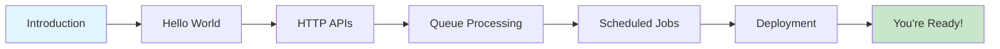

# Beginner Learning Path

**Master Transire fundamentals in 2-3 hours**

This structured learning path takes you from zero to building and deploying production-ready Transire applications. Each module builds on the previous one, with hands-on tutorials and clear learning objectives.

## Learning Objectives

By the end of this path, you will be able to:

- ✅ Understand what Transire is and when to use it
- ✅ Build HTTP APIs with routing and parameters
- ✅ Process messages asynchronously with type-safe queues
- ✅ Schedule periodic jobs with cron syntax
- ✅ Develop locally with hot reload
- ✅ Deploy to AWS with one command
- ✅ Understand local vs cloud runtime differences

---

## Prerequisites

Before starting, ensure you have:

- [x] **Go 1.22 or later** installed - [Download](https://golang.org/dl/)
- [x] **Basic Go knowledge** - Variables, functions, structs, error handling
- [x] **Basic HTTP concepts** - GET/POST, status codes, JSON
- [x] **AWS Account** (for deployment) - [Sign up](https://aws.amazon.com/free/)
- [x] **AWS CLI configured** - Run `aws configure`

**Verify your setup:**

```bash
$ go version
go version go1.22.0 darwin/arm64

$ aws sts get-caller-identity
{
    "Account": "123456789012",
    ...
}
```

---

## Your Learning Journey



---

## Module 1: Introduction to Transire

**Time:** 10 minutes • **Type:** Reading

### What You'll Learn

- What Transire is and what problems it solves
- Core concepts: handlers, manifest, local vs cloud
- When to use Transire vs other frameworks

### Materials

1. [What is Transire?](../../intro/what-is-transire.md) - 10 min read
2. [Core Concepts](../../intro/concepts.md) - 15 min read

### Learning Check

After this module, you should be able to answer:

- [ ] What are the three types of handlers in Transire?
- [ ] What is the build-time manifest used for?
- [ ] How does local mode differ from cloud mode?

**Time investment:** 10 minutes
**Next:** [Module 2: Hello World →](#module-2-hello-world)

---

## Module 2: Hello World

**Time:** 5 minutes • **Type:** Hands-on tutorial

### What You'll Learn

- How to create your first Transire application
- Basic app structure and registration patterns
- Running locally with `transire run`

### Hands-On Tutorial

Follow the step-by-step tutorial:

**[Hello World Tutorial →](../tutorials/01-hello-world/)**

You'll build a simple HTTP endpoint that returns "Hello, World!" and run it locally.

### What You Built

```go
func main() {
    app := transire.New()
    app.GET("/hello", helloWorld)
    app.Run()
}

func helloWorld(w http.ResponseWriter, r *http.Request) {
    response.OK(w, map[string]string{"message": "Hello, World!"})
}
```

### Learning Check

After this module, you should have:

- [x] Created a Transire project with `go.mod`
- [x] Written a simple HTTP handler
- [x] Started the local server with `transire run`
- [x] Made a request with `curl` and received a response

**Time investment:** 5 minutes
**Next:** [Module 3: HTTP APIs →](#module-3-building-http-apis)

---

## Module 3: Building HTTP APIs

**Time:** 30 minutes • **Type:** Hands-on tutorial

### What You'll Learn

- HTTP verb helpers (GET, POST, PUT, DELETE)
- URL parameters with Chi routing syntax
- Query parameters and headers
- Request body parsing and validation
- Response helpers for common status codes
- Error handling patterns

### Hands-On Tutorial

Follow the comprehensive REST API tutorial:

**[REST API Tutorial →](../tutorials/02-rest-api/)**

You'll build a complete orders API with CRUD operations, validation, and error handling.

### What You Built

```go
// Routes with URL parameters
app.GET("/orders/{id}", getOrder)
app.POST("/orders", createOrder)
app.PUT("/orders/{id}", updateOrder)
app.DELETE("/orders/{id}", deleteOrder)

// Full CRUD with validation and error handling
func createOrder(w http.ResponseWriter, r *http.Request) {
    var req CreateOrderRequest
    if err := json.NewDecoder(r.Body).Decode(&req); err != nil {
        response.BadRequest(w, "Invalid JSON")
        return
    }

    if err := validate(req); err != nil {
        response.BadRequest(w, err.Error())
        return
    }

    order := createOrderInDB(req)
    response.Created(w, order)
}
```

### Learning Check

After this module, you should be able to:

- [ ] Register routes with different HTTP verbs
- [ ] Extract URL parameters with `transire.URLParam()`
- [ ] Parse JSON request bodies
- [ ] Return appropriate HTTP status codes
- [ ] Handle validation errors gracefully

**Time investment:** 30 minutes
**Next:** [Module 4: Queue Processing →](#module-4-asynchronous-queue-processing)

---

## Module 4: Asynchronous Queue Processing

**Time:** 30 minutes • **Type:** Hands-on tutorial

### What You'll Learn

- What queues are and when to use them
- Type-safe queue handlers with generics
- Enqueuing messages from HTTP handlers
- Batch processing patterns
- Error handling and dead-letter queues
- Local queue emulator vs AWS SQS

### Hands-On Tutorial

Follow the queue processing tutorial:

**[Queue Processing Tutorial →](../tutorials/03-queue-processing/)**

You'll add async order fulfillment to your orders API using queues.

### What You Built

```go
// Register queue handler
app.RegisterQueue("fulfill-orders", fulfillOrders)

// Enqueue from HTTP handler
func createOrder(w http.ResponseWriter, r *http.Request) {
    order := createOrderInDB(req)

    // Process asynchronously
    app.Enqueue(r.Context(), "fulfill-orders", order)

    response.Created(w, order)
}

// Batch processing
func fulfillOrders(ctx context.Context, orders []Order) error {
    for _, order := range orders {
        if err := fulfillOrder(ctx, order); err != nil {
            return err  // Failed messages go to DLQ
        }
    }
    return nil
}
```

### Learning Check

After this module, you should be able to:

- [ ] Register a queue handler
- [ ] Enqueue messages from HTTP handlers
- [ ] Process batches of messages
- [ ] Understand when to use queues vs synchronous processing
- [ ] Handle failures with DLQs

**Time investment:** 30 minutes
**Next:** [Module 5: Scheduled Jobs →](#module-5-scheduled-jobs)

---

## Module 5: Scheduled Jobs

**Time:** 20 minutes • **Type:** Hands-on tutorial

### What You'll Learn

- When to use scheduled jobs
- Cron syntax and shorthand schedules
- Timezone handling
- Idempotent job design
- Local scheduler vs AWS EventBridge

### Hands-On Tutorial

Follow the scheduled jobs tutorial:

**[Scheduled Jobs Tutorial →](../tutorials/04-scheduled-jobs/)**

You'll add a daily report generation job that runs at 9 AM.

### What You Built

```go
// Register scheduled job
app.Schedule("daily-report", "@daily 09:00", generateDailyReport)

// Idempotent job handler
func generateDailyReport(ctx context.Context) error {
    log.Println("Generating daily report...")

    // Query database for yesterday's orders
    orders := getOrdersForYesterday(ctx)

    // Generate and send report
    report := createReport(orders)
    sendReport(ctx, report)

    return nil
}
```

### Learning Check

After this module, you should be able to:

- [ ] Register a scheduled job with cron syntax
- [ ] Use shorthand schedules like `@daily 09:00`
- [ ] Design idempotent jobs
- [ ] Test scheduled jobs locally

**Time investment:** 20 minutes
**Next:** [Module 6: Deployment →](#module-6-cloud-deployment)

---

## Module 6: Cloud Deployment

**Time:** 30 minutes • **Type:** Hands-on tutorial

### What You'll Learn

- Build-time manifest generation with `transire gen`
- Deployment process with `transire deploy`
- Understanding generated AWS resources
- Testing deployed APIs
- Viewing logs in CloudWatch
- Tearing down resources

### Hands-On Tutorial

Follow the deployment guide:

**[First Deployment →](../../guides/deployment/first-deployment/)**

You'll deploy your complete application to AWS Lambda.

### What Happened

```bash
$ transire gen
✓ Analyzed package main
✓ Found 4 HTTP routes
✓ Found 1 queue handler
✓ Found 1 scheduled job
✓ Generated transire_manifest.json

$ transire deploy --environment=dev
✓ Packaged handlers
✓ Generated OpenTofu configuration
✓ Applied infrastructure
→ API URL: https://abc123.execute-api.us-east-1.amazonaws.com
```

**Created AWS resources:**
- API Gateway HTTP API
- 3 Lambda functions (HTTP, queue, schedule)
- SQS queue with DLQ
- EventBridge rule
- IAM roles with least-privilege policies

### Learning Check

After this module, you should be able to:

- [ ] Generate the manifest with `transire gen`
- [ ] Deploy to AWS with `transire deploy`
- [ ] Test your deployed API
- [ ] View Lambda logs in CloudWatch
- [ ] Destroy resources with `transire destroy`

**Time investment:** 30 minutes
**Next:** [What's Next? →](#whats-next)

---

## Congratulations! 🎉

You've completed the Beginner Learning Path and built a production-ready cloud-native application with Transire!

### What You Accomplished

- ✅ Built a complete REST API with CRUD operations
- ✅ Implemented asynchronous queue processing
- ✅ Scheduled periodic jobs
- ✅ Deployed to AWS Lambda
- ✅ Understood local vs cloud runtime

### Your Skills

You can now:

- Build cloud-native APIs with Transire
- Design async workflows with queues
- Schedule background jobs
- Deploy to production on AWS
- Debug and troubleshoot issues

---

## What's Next?

### Continue Learning

**[Intermediate Learning Path →](intermediate-path/)**

Dive deeper into:
- Dependency injection patterns
- Advanced middleware
- Comprehensive testing
- Production deployment strategies
- Performance optimization

### Explore Advanced Topics

- [Testing Strategies](../../guides/development/testing-strategies/) - Write tests for your handlers
- [Dependency Injection](../../reference/sdk/di-api/) - Manage service dependencies
- [Middleware Patterns](../../guides/patterns/middleware-patterns/) - Authentication, logging, CORS
- [Error Handling](../../guides/patterns/error-handling/) - Production error strategies
- [Production Checklist](../../guides/deployment/production-checklist/) - Pre-launch checklist

### Build Real Projects

- [Complete Examples](../../examples/) - Full-stack example applications
- [Order Processing System](../../examples/rest-api/) - Expanded orders API
- [Image Processing Pipeline](../../examples/queue-processing/) - File processing with queues

### Join the Community

- [GitHub Discussions](https://github.com/transire/transire/discussions) - Ask questions
- [Showcase](../../community/showcase/) - Share your projects
- [Contributing](../../community/contributing/) - Help improve Transire

---

## Learning Resources

### Quick Reference

- [SDK API Reference](../../reference/sdk/overview/) - Complete API documentation
- [CLI Reference](../../reference/cli/overview/) - All CLI commands
- [Config Schema](../../reference/config/schema/) - Configuration options
- [Error Codes](../../reference/error-codes/) - Error code reference

### Get Help

- [FAQ](../../community/faq/) - Common questions
- [Troubleshooting](../../guides/troubleshooting/) - Diagnostic guides
- [GitHub Issues](https://github.com/transire/transire/issues) - Report bugs

---

## Share Your Progress

Built something with Transire? We'd love to see it!

- Tweet with `#Transire`
- Share in [GitHub Discussions](https://github.com/transire/transire/discussions)
- Add to [Community Showcase](../../community/showcase/)

---

**Ready for the next level?** [Continue to Intermediate Path →](intermediate-path/)
