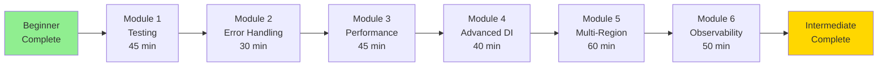

# Intermediate Learning Path

> **Level Up:** Master production patterns, testing, and advanced features

## Your Journey



**Total Time:** 4-5 hours
**Outcome:** Production-ready expertise

---

## What You'll Master

After completing this path, you'll be able to:

- ✅ Write comprehensive tests for all handler types
- ✅ Implement production-grade error handling
- ✅ Optimize application performance
- ✅ Use advanced dependency injection patterns
- ✅ Deploy to multiple regions and environments
- ✅ Set up observability and monitoring
- ✅ Debug production issues efficiently
- ✅ Follow security best practices

---

## Prerequisites

Before starting, ensure you've completed:

- [x] Beginner Learning Path (all 6 modules)
- [x] Deployed an application to AWS
- [x] Worked with Transire for 2-3 weeks
- [x] Comfortable with Go and HTTP concepts

**If not:** Start with the [Beginner Path](beginner-path.md)

---

## Module 1: Testing Strategies

**Time:** 45 minutes
**Complexity:** Intermediate

### What You'll Learn

- Unit testing handlers
- Integration testing with testkit
- Mocking dependencies
- Testing middleware
- Testing queue handlers
- Testing scheduled jobs
- Test coverage strategies

### Topics

#### Unit Testing HTTP Handlers

```go
func TestCreateOrder(t *testing.T) {
    // Mock database
    mockDB := &MockDatabase{
        CreateOrderFunc: func(ctx context.Context, order *Order) error {
            if order.Quantity <= 0 {
                return errors.New("invalid quantity")
            }
            return nil
        },
    }

    // Create test request
    body := `{"product": "Widget", "quantity": 5, "price": 99.99}`
    req := httptest.NewRequest("POST", "/orders", strings.NewReader(body))
    req.Header.Set("Content-Type", "application/json")
    rec := httptest.NewRecorder()

    // Call handler with mock
    createOrder(rec, req, mockDB)

    // Assert
    if rec.Code != http.StatusCreated {
        t.Errorf("Expected 201, got %d", rec.Code)
    }

    // Verify mock was called
    if !mockDB.CreateOrderCalled {
        t.Error("Expected CreateOrder to be called")
    }
}
```

#### Integration Testing with Testkit

```go
import "github.com/transire/sdk-go/testkit"

func TestOrdersAPI(t *testing.T) {
    tk := testkit.New(t)

    // Setup test database
    db := setupTestDB(t)
    defer db.Close()

    // Register services
    transire.Provide(func() *Database { return db })

    // Register routes
    tk.POST("/orders", createOrder)
    tk.GET("/orders/{id}", getOrder)

    // Test create order
    resp := tk.Post("/orders", map[string]interface{}{
        "product":  "Widget",
        "quantity": 5,
        "price":    99.99,
    })

    tk.AssertStatus(201)
    tk.AssertHeader("Location", "/orders/ORD-")

    orderID := resp.JSON()["id"].(string)

    // Test get order
    resp = tk.Get("/orders/" + orderID)
    tk.AssertStatus(200)
    tk.AssertJSONPath("$.product", "Widget")
    tk.AssertJSONPath("$.quantity", 5)
}
```

#### Testing Queue Handlers

```go
func TestFulfillOrders(t *testing.T) {
    ctx := context.Background()
    mockDB := &MockDatabase{}

    orders := []Order{
        {ID: "1", Product: "A", Status: "pending"},
        {ID: "2", Product: "B", Status: "pending"},
    }

    err := fulfillOrders(ctx, orders, mockDB)
    if err != nil {
        t.Fatalf("Expected no error, got: %v", err)
    }

    // Verify all orders processed
    if mockDB.UpdateCount != 2 {
        t.Errorf("Expected 2 updates, got %d", mockDB.UpdateCount)
    }
}
```

### Hands-On Exercise

**Task:** Add comprehensive tests to your orders API

1. Write unit tests for all HTTP handlers
2. Create integration tests using testkit
3. Test error cases and edge conditions
4. Add tests for queue and schedule handlers
5. Achieve >80% code coverage

### Learning Check

- [ ] Can write unit tests for HTTP handlers
- [ ] Can use testkit for integration tests
- [ ] Can mock dependencies effectively
- [ ] Can test error scenarios
- [ ] Understand test coverage metrics

### Resources

- [Testing Guide](../../guides/testing/) - Complete testing reference
- [Testkit API](../../reference/sdk/testkit-api/) - Testkit documentation
- [Go Testing Best Practices](https://go.dev/blog/table-driven-tests)

**Time to complete:** 45 minutes

---

## Module 2: Error Handling Patterns

**Time:** 30 minutes
**Complexity:** Intermediate

### What You'll Learn

- Structured error handling
- Custom error types
- Error wrapping and unwrapping
- HTTP error responses
- Queue error handling
- Recovery from panics
- Error logging and tracing

### Topics

#### Custom Error Types

```go
// Domain errors
type OrderError struct {
    Code    string
    Message string
    Details map[string]interface{}
}

func (e *OrderError) Error() string {
    return fmt.Sprintf("%s: %s", e.Code, e.Message)
}

var (
    ErrOrderNotFound   = &OrderError{Code: "ORDER_NOT_FOUND", Message: "Order not found"}
    ErrInvalidQuantity = &OrderError{Code: "INVALID_QUANTITY", Message: "Quantity must be positive"}
    ErrOutOfStock      = &OrderError{Code: "OUT_OF_STOCK", Message: "Product out of stock"}
)

// Usage in handlers
func getOrder(w http.ResponseWriter, r *http.Request, db *Database) {
    id := transire.URLParam(r, "id")

    order, err := db.GetOrder(r.Context(), id)
    if err != nil {
        switch {
        case errors.Is(err, ErrOrderNotFound):
            response.NotFound(w, err.Error())
        default:
            response.InternalServerError(w, "Failed to fetch order")
        }
        return
    }

    response.OK(w, order)
}
```

#### Error Wrapping

```go
func (db *Database) GetOrder(ctx context.Context, id string) (*Order, error) {
    var order Order
    err := db.DB.QueryRowContext(ctx,
        "SELECT id, product, quantity FROM orders WHERE id = $1", id,
    ).Scan(&order.ID, &order.Product, &order.Quantity)

    if err == sql.ErrNoRows {
        return nil, ErrOrderNotFound
    }
    if err != nil {
        return nil, fmt.Errorf("database query failed: %w", err)
    }

    return &order, nil
}

// Unwrap errors
func handleError(err error) {
    if errors.Is(err, ErrOrderNotFound) {
        // Handle not found
    } else if errors.Is(err, sql.ErrNoRows) {
        // Handle no rows
    }
}
```

#### Structured Error Responses

```go
type ErrorResponse struct {
    Error struct {
        Code    string                 `json:"code"`
        Message string                 `json:"message"`
        Details map[string]interface{} `json:"details,omitempty"`
    } `json:"error"`
    RequestID string `json:"request_id"`
}

func respondError(w http.ResponseWriter, status int, code, message string, details map[string]interface{}) {
    requestID, _ := r.Context().Value("request_id").(string)

    resp := ErrorResponse{RequestID: requestID}
    resp.Error.Code = code
    resp.Error.Message = message
    resp.Error.Details = details

    w.Header().Set("Content-Type", "application/json")
    w.WriteHeader(status)
    json.NewEncoder(w).Encode(resp)
}
```

### Hands-On Exercise

**Task:** Implement structured error handling

1. Define custom error types for your domain
2. Use error wrapping throughout your code
3. Return structured error responses
4. Add error logging with context
5. Test error scenarios

### Learning Check

- [ ] Can create custom error types
- [ ] Can wrap and unwrap errors
- [ ] Can return structured error responses
- [ ] Understand error handling in queues
- [ ] Can trace errors across services

### Resources

- [Error Handling Guide](../../guides/patterns/error-handling/)
- [Go Error Handling](https://go.dev/blog/error-handling-and-go)

**Time to complete:** 30 minutes

---

## Module 3: Performance Optimization

**Time:** 45 minutes
**Complexity:** Intermediate

### What You'll Learn

- Lambda cold start optimization
- Memory tuning
- Database connection pooling
- Caching strategies
- Batch processing optimization
- Monitoring performance
- Cost optimization

### Topics

#### Lambda Cold Start Optimization

```go
// Reduce binary size
// Build with: go build -ldflags="-s -w"

// Minimize init() work
var (
    db     *Database
    cache  *Cache
    config *Config
)

func init() {
    // Only critical initialization
    config = loadConfig()

    // Defer expensive operations until first use
}

// Lazy initialization
func getDB() *Database {
    if db == nil {
        db = connectDB(config)
    }
    return db
}
```

#### Connection Pooling

```go
func NewDatabase(cfg *Config) (*Database, error) {
    db, err := sql.Open("postgres", cfg.DatabaseURL)
    if err != nil {
        return nil, err
    }

    // Optimize for Lambda
    db.SetMaxOpenConns(10)        // Limit connections
    db.SetMaxIdleConns(2)         // Keep some idle
    db.SetConnMaxLifetime(5 * time.Minute)
    db.SetConnMaxIdleTime(1 * time.Minute)

    return &Database{DB: db}, nil
}
```

#### Caching with Redis

```go
type Cache struct {
    client *redis.Client
}

func (c *Cache) GetOrFetch(ctx context.Context, key string, fetch func() (interface{}, error)) (interface{}, error) {
    // Try cache first
    val, err := c.client.Get(ctx, key).Result()
    if err == nil {
        var result interface{}
        json.Unmarshal([]byte(val), &result)
        return result, nil
    }

    // Cache miss - fetch
    result, err := fetch()
    if err != nil {
        return nil, err
    }

    // Store in cache
    data, _ := json.Marshal(result)
    c.client.Set(ctx, key, data, 5*time.Minute)

    return result, nil
}

// Usage
func getOrder(w http.ResponseWriter, r *http.Request, db *Database, cache *Cache) {
    id := transire.URLParam(r, "id")

    order, err := cache.GetOrFetch(r.Context(), "order:"+id, func() (interface{}, error) {
        return db.GetOrder(r.Context(), id)
    })

    response.OK(w, order)
}
```

#### Batch Processing Optimization

```go
func fulfillOrders(ctx context.Context, orderBatch []Order, db *Database) error {
    // Process in parallel with controlled concurrency
    sem := make(chan struct{}, 5) // Max 5 concurrent
    errors := make(chan error, len(orderBatch))

    var wg sync.WaitGroup
    for _, order := range orderBatch {
        wg.Add(1)
        go func(o Order) {
            defer wg.Done()

            sem <- struct{}{}        // Acquire
            defer func() { <-sem }() // Release

            if err := processOrder(ctx, o, db); err != nil {
                errors <- err
            }
        }(order)
    }

    wg.Wait()
    close(errors)

    // Collect errors
    var errs []error
    for err := range errors {
        errs = append(errs, err)
    }

    if len(errs) > 0 {
        return fmt.Errorf("failed to process %d orders", len(errs))
    }

    return nil
}
```

### Hands-On Exercise

**Task:** Optimize your application

1. Analyze Lambda cold start times
2. Tune Lambda memory allocation
3. Add connection pooling
4. Implement caching layer
5. Optimize batch processing
6. Measure performance improvements

### Learning Check

- [ ] Can optimize Lambda cold starts
- [ ] Can tune memory allocation
- [ ] Can implement caching
- [ ] Understand connection pooling
- [ ] Can measure performance

### Resources

- [Performance Guide](../../guides/performance/optimization/)
- [AWS Lambda Performance](https://docs.aws.amazon.com/lambda/latest/dg/best-practices.html)

**Time to complete:** 45 minutes

---

## Module 4: Advanced Dependency Injection

**Time:** 40 minutes
**Complexity:** Intermediate

### What You'll Learn

- Lifecycle management
- Conditional registration
- Multiple implementations
- Factory patterns
- Cleanup and shutdown
- Testing with DI

### Topics

#### Lifecycle Management

```go
// Service with initialization and cleanup
type Database struct {
    DB *sql.DB
}

func NewDatabase(cfg *Config) (*Database, Cleanup, error) {
    db, err := sql.Open("postgres", cfg.DatabaseURL)
    if err != nil {
        return nil, nil, err
    }

    cleanup := func() error {
        return db.Close()
    }

    return &Database{DB: db}, cleanup, nil
}

// Register with cleanup
transire.Provide(func(cfg *Config) (*Database, error) {
    db, cleanup, err := NewDatabase(cfg)
    if err != nil {
        return nil, err
    }

    // Register cleanup on app shutdown
    transire.OnShutdown(cleanup)

    return db, nil
})
```

#### Conditional Registration

```go
// Register different implementations based on environment
func main() {
    app := transire.New()

    if os.Getenv("ENVIRONMENT") == "production" {
        // Production: Use real services
        transire.Provide(func() *Cache { return NewRedisCache() })
        transire.Provide(func() *Queue { return NewSQSQueue() })
    } else {
        // Development: Use mocks
        transire.Provide(func() *Cache { return NewMemoryCache() })
        transire.Provide(func() *Queue { return NewInMemoryQueue() })
    }

    app.Run()
}
```

#### Factory Patterns

```go
// Factory for creating services
type EmailServiceFactory struct {
    config *Config
}

func (f *EmailServiceFactory) Create(provider string) EmailService {
    switch provider {
    case "ses":
        return NewSESEmailService(f.config)
    case "sendgrid":
        return NewSendGridEmailService(f.config)
    default:
        return NewSMTPEmailService(f.config)
    }
}

// Register factory
transire.Provide(func(cfg *Config) *EmailServiceFactory {
    return &EmailServiceFactory{config: cfg}
})

// Use factory in handler
func sendEmail(w http.ResponseWriter, r *http.Request, factory *EmailServiceFactory) {
    provider := r.URL.Query().Get("provider")
    emailService := factory.Create(provider)
    emailService.Send(...)
}
```

### Hands-On Exercise

**Task:** Implement advanced DI patterns

1. Add lifecycle management to services
2. Use conditional registration
3. Implement factory pattern
4. Add graceful shutdown
5. Test DI in isolation

### Learning Check

- [ ] Can manage service lifecycle
- [ ] Can conditionally register services
- [ ] Can use factory patterns
- [ ] Can implement graceful shutdown
- [ ] Can test with DI

### Resources

- [DI Guide](../../guides/patterns/dependency-injection/)
- [Go DI Patterns](https://github.com/google/wire)

**Time to complete:** 40 minutes

---

## Module 5: Multi-Region Deployment

**Time:** 60 minutes
**Complexity:** Intermediate

### What You'll Learn

- Multi-region architecture
- Global routing
- Data replication
- Failover strategies
- Regional configuration
- Cost optimization

### Topics

#### Multi-Region Configuration

```yaml
# transire.yaml
version: 1
service: orders-api

# Primary region
deploy:
  region: us-east-1
  replicate_to:
    - us-west-2
    - eu-west-1
    - ap-southeast-1

# Region-specific configuration
regions:
  us-east-1:
    deploy:
      memory_mb: 1024
    env:
      DATABASE_URL: "postgres://us-east-1.rds.amazonaws.com/orders"

  us-west-2:
    deploy:
      memory_mb: 512  # Less traffic
    env:
      DATABASE_URL: "postgres://us-west-2.rds.amazonaws.com/orders"
```

#### Deploy to Multiple Regions

```bash
# Deploy to all regions
$ transire deploy --env prod --all-regions

Deploying to 4 regions:
  ✓ us-east-1 (primary)
  ✓ us-west-2
  ✓ eu-west-1
  ✓ ap-southeast-1

Setting up global routing...
  ✓ Route 53 health checks
  ✓ CloudFront distribution
  ✓ Geolocation routing

Global endpoint: https://api.yourdomain.com
```

#### Regional Failover

```go
// Regional client with automatic failover
type MultiRegionClient struct {
    clients map[string]*Client
    regions []string
}

func (m *MultiRegionClient) Call(ctx context.Context, req *Request) (*Response, error) {
    for _, region := range m.regions {
        client := m.clients[region]

        resp, err := client.Call(ctx, req)
        if err == nil {
            return resp, nil
        }

        log.Printf("Region %s failed: %v, trying next", region, err)
    }

    return nil, errors.New("all regions failed")
}
```

### Hands-On Exercise

**Task:** Deploy to multiple regions

1. Configure multi-region deployment
2. Deploy to 2+ regions
3. Set up global routing
4. Test regional failover
5. Monitor cross-region latency

### Learning Check

- [ ] Can configure multi-region deployment
- [ ] Can deploy to multiple regions
- [ ] Understand global routing
- [ ] Can implement failover
- [ ] Can optimize regional costs

### Resources

- [Multi-Region Guide](../../guides/deployment/multi-region/)
- [AWS Global Infrastructure](https://aws.amazon.com/about-aws/global-infrastructure/)

**Time to complete:** 60 minutes

---

## Module 6: Observability & Monitoring

**Time:** 50 minutes
**Complexity:** Intermediate

### What You'll Learn

- Structured logging
- Distributed tracing
- Metrics collection
- Alerting strategies
- Dashboard creation
- Log aggregation
- Performance monitoring

### Topics

#### Structured Logging

```go
import "go.uber.org/zap"

func main() {
    // Create structured logger
    logger, _ := zap.NewProduction()
    defer logger.Sync()

    transire.Provide(func() *zap.Logger { return logger })

    app.Run()
}

func createOrder(w http.ResponseWriter, r *http.Request, logger *zap.Logger) {
    requestID := r.Context().Value("request_id").(string)

    logger.Info("Creating order",
        zap.String("request_id", requestID),
        zap.String("user_id", getUserID(r)),
        zap.String("product", req.Product),
        zap.Int("quantity", req.Quantity),
    )

    // ... create order ...

    logger.Info("Order created",
        zap.String("request_id", requestID),
        zap.String("order_id", order.ID),
        zap.Duration("duration", time.Since(start)),
    )
}
```

#### Distributed Tracing

```go
import (
    "go.opentelemetry.io/otel"
    "go.opentelemetry.io/otel/trace"
)

func createOrder(w http.ResponseWriter, r *http.Request, db *Database) {
    ctx := r.Context()
    tracer := otel.Tracer("orders-api")

    ctx, span := tracer.Start(ctx, "createOrder")
    defer span.End()

    // Add attributes
    span.SetAttributes(
        attribute.String("user.id", getUserID(r)),
        attribute.String("product", req.Product),
    )

    // Create order (propagate context)
    order, err := db.CreateOrder(ctx, req)
    if err != nil {
        span.RecordError(err)
        response.InternalServerError(w, "Failed")
        return
    }

    span.SetAttributes(attribute.String("order.id", order.ID))
    response.Created(w, order)
}
```

#### Custom Metrics

```go
import "github.com/prometheus/client_golang/prometheus"

var (
    ordersCreated = prometheus.NewCounterVec(
        prometheus.CounterOpts{
            Name: "orders_created_total",
            Help: "Total orders created",
        },
        []string{"status"},
    )

    orderValue = prometheus.NewHistogram(
        prometheus.HistogramOpts{
            Name:    "order_value_dollars",
            Help:    "Order value distribution",
            Buckets: prometheus.LinearBuckets(0, 50, 20),
        },
    )
)

func init() {
    prometheus.MustRegister(ordersCreated)
    prometheus.MustRegister(orderValue)
}

func createOrder(w http.ResponseWriter, r *http.Request) {
    // ... create order ...

    ordersCreated.WithLabelValues("success").Inc()
    orderValue.Observe(order.Price * float64(order.Quantity))
}
```

### Hands-On Exercise

**Task:** Add comprehensive observability

1. Implement structured logging
2. Add distributed tracing
3. Create custom metrics
4. Set up CloudWatch dashboard
5. Configure alerts
6. Test monitoring in production

### Learning Check

- [ ] Can implement structured logging
- [ ] Can add distributed tracing
- [ ] Can collect custom metrics
- [ ] Can create dashboards
- [ ] Can configure alerts

### Resources

- [Observability Guide](../../guides/observability/monitoring/)
- [OpenTelemetry Go](https://opentelemetry.io/docs/instrumentation/go/)

**Time to complete:** 50 minutes

---

## Final Project

**Time:** 2-3 hours
**Build:** Production-Ready E-Commerce API

### Requirements

Build a complete e-commerce backend with:

1. **Features:**
   - User authentication & authorization
   - Product catalog
   - Shopping cart
   - Order processing
   - Payment integration (Stripe)
   - Email notifications

2. **Technical Requirements:**
   - Comprehensive tests (>80% coverage)
   - Structured error handling
   - Performance optimized
   - Multi-region deployment
   - Full observability
   - CI/CD pipeline

3. **Production Deployment:**
   - Deploy to 2+ AWS regions
   - Set up monitoring and alerts
   - Configure custom domain
   - Load test with 1000 req/s
   - Document API with OpenAPI

### Deliverables

- [ ] Complete source code
- [ ] Test suite
- [ ] Deployment scripts
- [ ] API documentation
- [ ] Architecture diagram
- [ ] Performance report

### Success Criteria

- All tests passing
- <500ms p99 latency
- 99.9% uptime
- $50/month AWS cost
- Handles 10k orders/day

---

## What's Next?

After completing the Intermediate Path:

### Advanced Learning Path

Ready for expert-level topics:
- [Advanced Learning Path →](advanced-path.md)

### Specialization Tracks

Choose your focus:
- **Backend Architect** - System design, scalability
- **DevOps Engineer** - Infrastructure, automation
- **Security Engineer** - Authentication, compliance

### Community

Share your work:
- Post project to [Showcase](*Coming soon*)
- Contribute to [Examples](../../examples/)
- Help others in [Discussions](https://github.com/transire/transire/discussions)

---

## Congratulations! 🎉

You've completed the Intermediate Learning Path and mastered:

- ✅ Comprehensive testing strategies
- ✅ Production error handling
- ✅ Performance optimization
- ✅ Advanced dependency injection
- ✅ Multi-region deployment
- ✅ Full observability stack

**You're now an Intermediate Transire developer!**

Ready for more? → [Advanced Path](advanced-path.md)

---

## See Also

- [Beginner Path](beginner-path.md) - Review fundamentals
- [Advanced Path](advanced-path.md) - Master expert topics
- [Guides](../../guides/) - Deep dives into specific topics
- [API Reference](../../reference/sdk/overview/) - Complete API docs

