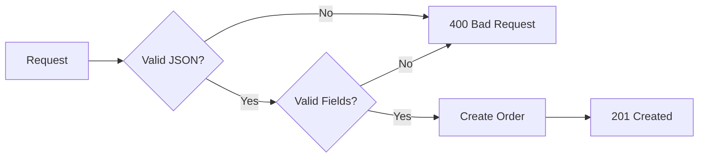

# Tutorial: Build a REST API

> **Quick Summary:** Build a complete orders API with CRUD operations, validation, and error handling

## What You'll Build

A production-ready REST API for managing orders:

```bash
GET    /orders          # List all orders
GET    /orders/{id}     # Get specific order
POST   /orders          # Create order
PUT    /orders/{id}     # Update order
DELETE /orders/{id}     # Delete order
```

**Time:** 15 minutes • **Difficulty:** Beginner

---

## At a Glance

- **What:** Complete CRUD API with validation
- **Why:** Learn HTTP handlers, routing, validation, error handling
- **Prerequisites:** [Hello World tutorial](01-hello-world.md)
- **Result:** Production-ready REST API

---

## Step 1: Project Setup

Create a new project:

```bash
mkdir orders-api
cd orders-api
go mod init github.com/yourusername/orders-api
go get github.com/transire/transire-sdk-go@latest
```

---

## Step 2: Define Your Data Model

Create `main.go` and define the Order model:

```go
package main

import (
    "time"
)

// Order represents an order in the system
type Order struct {
    ID        string    `json:"id"`
    Product   string    `json:"product"`
    Quantity  int       `json:"quantity"`
    Price     float64   `json:"price"`
    Status    string    `json:"status"`
    CreatedAt time.Time `json:"created_at"`
    UpdatedAt time.Time `json:"updated_at"`
}

// CreateOrderRequest is the payload for creating orders
type CreateOrderRequest struct {
    Product  string  `json:"product"`
    Quantity int     `json:"quantity"`
    Price    float64 `json:"price"`
}

// UpdateOrderRequest is the payload for updating orders
type UpdateOrderRequest struct {
    Product  *string  `json:"product,omitempty"`
    Quantity *int     `json:"quantity,omitempty"`
    Price    *float64 `json:"price,omitempty"`
    Status   *string  `json:"status,omitempty"`
}

// In-memory store (use database in production)
var orders = make(map[string]*Order)
```

**Why these types?**

| Type | Purpose |
|------|---------|
| `Order` | Main domain model with all fields |
| `CreateOrderRequest` | Input validation for creation |
| `UpdateOrderRequest` | Partial updates with pointers |

---

## Step 3: Create the Application

Add the main function and route registration:

```go
import (
    "context"
    "encoding/json"
    "fmt"
    "net/http"
    "time"

    "github.com/transire/transire-sdk-go"
    "github.com/transire/transire-sdk-go/response"
)

func main() {
    app := transire.New()

    // Register CRUD routes
    app.GET("/orders", listOrders)
    app.GET("/orders/{id}", getOrder)
    app.POST("/orders", createOrder)
    app.PUT("/orders/{id}", updateOrder)
    app.DELETE("/orders/{id}", deleteOrder)

    app.Run()
}
```

---

## Step 4: Implement List Orders

```go
// listOrders returns all orders
func listOrders(w http.ResponseWriter, r *http.Request) {
    // Convert map to slice
    orderList := make([]*Order, 0, len(orders))
    for _, order := range orders {
        orderList = append(orderList, order)
    }

    // Return 200 OK with array
    response.OK(w, orderList)
}
```

**Test it:**

```bash
$ curl http://localhost:8080/orders
[]
```

---

## Step 5: Implement Get Order

```go
// getOrder returns a specific order by ID
func getOrder(w http.ResponseWriter, r *http.Request) {
    // Extract ID from URL
    id := transire.URLParam(r, "id")

    // Look up order
    order, exists := orders[id]
    if !exists {
        response.NotFound(w, fmt.Sprintf("Order %s not found", id))
        return
    }

    // Return 200 OK with order
    response.OK(w, order)
}
```

**Key patterns:**

1. Extract URL parameter with `transire.URLParam()`
2. Check existence before accessing
3. Return 404 if not found
4. Return 200 with data if found

---

## Step 6: Implement Create Order (with Validation)

```go
// createOrder creates a new order
func createOrder(w http.ResponseWriter, r *http.Request) {
    // Parse JSON request body
    var req CreateOrderRequest
    if err := json.NewDecoder(r.Body).Decode(&req); err != nil {
        response.BadRequest(w, "Invalid JSON: "+err.Error())
        return
    }

    // Validate input
    if err := validateCreateOrder(&req); err != nil {
        response.BadRequest(w, err.Error())
        return
    }

    // Create order
    order := &Order{
        ID:        generateID(),
        Product:   req.Product,
        Quantity:  req.Quantity,
        Price:     req.Price,
        Status:    "pending",
        CreatedAt: time.Now(),
        UpdatedAt: time.Now(),
    }

    // Store order
    orders[order.ID] = order

    // Return 201 Created with location header
    w.Header().Set("Location", fmt.Sprintf("/orders/%s", order.ID))
    response.Created(w, order)
}

// validateCreateOrder validates create order request
func validateCreateOrder(req *CreateOrderRequest) error {
    if req.Product == "" {
        return fmt.Errorf("product is required")
    }
    if req.Quantity <= 0 {
        return fmt.Errorf("quantity must be greater than 0")
    }
    if req.Price < 0 {
        return fmt.Errorf("price must be non-negative")
    }
    return nil
}

// generateID generates a unique order ID
func generateID() string {
    return fmt.Sprintf("ORD-%d", time.Now().UnixNano())
}
```

**Validation flow:**



**Test it:**

```bash
# Valid request
$ curl -X POST http://localhost:8080/orders \
  -H "Content-Type: application/json" \
  -d '{
    "product": "Widget",
    "quantity": 5,
    "price": 99.99
  }'

{
  "id": "ORD-1234567890",
  "product": "Widget",
  "quantity": 5,
  "price": 99.99,
  "status": "pending",
  "created_at": "2025-11-10T10:00:00Z",
  "updated_at": "2025-11-10T10:00:00Z"
}

# Invalid request
$ curl -X POST http://localhost:8080/orders \
  -H "Content-Type: application/json" \
  -d '{
    "product": "",
    "quantity": -1
  }'

{
  "error": "product is required"
}
```

---

## Step 7: Implement Update Order

```go
// updateOrder updates an existing order
func updateOrder(w http.ResponseWriter, r *http.Request) {
    // Extract ID
    id := transire.URLParam(r, "id")

    // Check if order exists
    order, exists := orders[id]
    if !exists {
        response.NotFound(w, fmt.Sprintf("Order %s not found", id))
        return
    }

    // Parse request body
    var req UpdateOrderRequest
    if err := json.NewDecoder(r.Body).Decode(&req); err != nil {
        response.BadRequest(w, "Invalid JSON: "+err.Error())
        return
    }

    // Apply partial updates
    if req.Product != nil {
        order.Product = *req.Product
    }
    if req.Quantity != nil {
        if *req.Quantity <= 0 {
            response.BadRequest(w, "quantity must be greater than 0")
            return
        }
        order.Quantity = *req.Quantity
    }
    if req.Price != nil {
        if *req.Price < 0 {
            response.BadRequest(w, "price must be non-negative")
            return
        }
        order.Price = *req.Price
    }
    if req.Status != nil {
        // Validate status
        validStatuses := map[string]bool{
            "pending":   true,
            "confirmed": true,
            "shipped":   true,
            "delivered": true,
            "cancelled": true,
        }
        if !validStatuses[*req.Status] {
            response.BadRequest(w, "invalid status")
            return
        }
        order.Status = *req.Status
    }

    order.UpdatedAt = time.Now()

    // Return updated order
    response.OK(w, order)
}
```

**Why pointers in UpdateOrderRequest?**

Pointers allow us to distinguish between:
- Field not provided (nil) → Don't update
- Field provided with zero value (e.g., 0) → Update to zero

**Test it:**

```bash
# Partial update (only status)
$ curl -X PUT http://localhost:8080/orders/ORD-1234567890 \
  -H "Content-Type: application/json" \
  -d '{
    "status": "confirmed"
  }'

{
  "id": "ORD-1234567890",
  "product": "Widget",
  "quantity": 5,
  "price": 99.99,
  "status": "confirmed",
  "created_at": "2025-11-10T10:00:00Z",
  "updated_at": "2025-11-10T10:05:00Z"
}
```

---

## Step 8: Implement Delete Order

```go
// deleteOrder deletes an order
func deleteOrder(w http.ResponseWriter, r *http.Request) {
    // Extract ID
    id := transire.URLParam(r, "id")

    // Check if order exists
    if _, exists := orders[id]; !exists {
        response.NotFound(w, fmt.Sprintf("Order %s not found", id))
        return
    }

    // Delete order
    delete(orders, id)

    // Return 204 No Content
    w.WriteHeader(http.StatusNoContent)
}
```

**Test it:**

```bash
$ curl -X DELETE http://localhost:8080/orders/ORD-1234567890 -v

< HTTP/1.1 204 No Content
```

---

## Step 9: Run and Test Complete API

Start the server:

```bash
$ go run main.go
✓ Starting HTTP server on :8080
→ Ready: http://localhost:8080
```

Test the full workflow:

```bash
# 1. List orders (empty)
$ curl http://localhost:8080/orders
[]

# 2. Create an order
$ curl -X POST http://localhost:8080/orders \
  -H "Content-Type: application/json" \
  -d '{"product":"Widget","quantity":5,"price":99.99}'

# 3. List orders (has 1 order)
$ curl http://localhost:8080/orders
[{"id":"ORD-...","product":"Widget",...}]

# 4. Get specific order
$ curl http://localhost:8080/orders/ORD-...

# 5. Update order
$ curl -X PUT http://localhost:8080/orders/ORD-... \
  -H "Content-Type: application/json" \
  -d '{"status":"confirmed"}'

# 6. Delete order
$ curl -X DELETE http://localhost:8080/orders/ORD-...

# 7. Verify deleted (404)
$ curl http://localhost:8080/orders/ORD-...
{"error":"Order ORD-... not found"}
```

---

## Common Patterns Explained

### 1. Error Handling

```go
// ✅ Good: Specific error messages
if req.Product == "" {
    response.BadRequest(w, "product is required")
    return
}

// ❌ Bad: Generic error
if req.Product == "" {
    response.BadRequest(w, "invalid input")
    return
}
```

### 2. Validation

```go
// ✅ Good: Validate before processing
if err := validate(req); err != nil {
    response.BadRequest(w, err.Error())
    return
}

// ❌ Bad: No validation
order := createOrder(req)  // Might create invalid order
```

### 3. Partial Updates

```go
// ✅ Good: Use pointers for optional fields
type UpdateRequest struct {
    Name *string `json:"name,omitempty"`
}

// ❌ Bad: Can't distinguish nil from ""
type UpdateRequest struct {
    Name string `json:"name"`
}
```

### 4. Response Status Codes

```go
// Use the right status code
response.OK(w, data)              // 200 - Success
response.Created(w, data)         // 201 - Created resource
w.WriteHeader(http.StatusNoContent) // 204 - Deleted
response.BadRequest(w, msg)       // 400 - Invalid input
response.NotFound(w, msg)         // 404 - Not found
response.InternalServerError(w, msg) // 500 - Server error
```

---

## Complete Code

Here's the complete `main.go`:

```go
package main

import (
    "encoding/json"
    "fmt"
    "net/http"
    "time"

    "github.com/transire/transire-sdk-go"
    "github.com/transire/transire-sdk-go/response"
)

func main() {
    app := transire.New()

    app.GET("/orders", listOrders)
    app.GET("/orders/{id}", getOrder)
    app.POST("/orders", createOrder)
    app.PUT("/orders/{id}", updateOrder)
    app.DELETE("/orders/{id}", deleteOrder)

    app.Run()
}

// Order represents an order in the system
type Order struct {
    ID        string    `json:"id"`
    Product   string    `json:"product"`
    Quantity  int       `json:"quantity"`
    Price     float64   `json:"price"`
    Status    string    `json:"status"`
    CreatedAt time.Time `json:"created_at"`
    UpdatedAt time.Time `json:"updated_at"`
}

type CreateOrderRequest struct {
    Product  string  `json:"product"`
    Quantity int     `json:"quantity"`
    Price    float64 `json:"price"`
}

type UpdateOrderRequest struct {
    Product  *string  `json:"product,omitempty"`
    Quantity *int     `json:"quantity,omitempty"`
    Price    *float64 `json:"price,omitempty"`
    Status   *string  `json:"status,omitempty"`
}

var orders = make(map[string]*Order)

func listOrders(w http.ResponseWriter, r *http.Request) {
    orderList := make([]*Order, 0, len(orders))
    for _, order := range orders {
        orderList = append(orderList, order)
    }
    response.OK(w, orderList)
}

func getOrder(w http.ResponseWriter, r *http.Request) {
    id := transire.URLParam(r, "id")
    order, exists := orders[id]
    if !exists {
        response.NotFound(w, fmt.Sprintf("Order %s not found", id))
        return
    }
    response.OK(w, order)
}

func createOrder(w http.ResponseWriter, r *http.Request) {
    var req CreateOrderRequest
    if err := json.NewDecoder(r.Body).Decode(&req); err != nil {
        response.BadRequest(w, "Invalid JSON: "+err.Error())
        return
    }

    if err := validateCreateOrder(&req); err != nil {
        response.BadRequest(w, err.Error())
        return
    }

    order := &Order{
        ID:        generateID(),
        Product:   req.Product,
        Quantity:  req.Quantity,
        Price:     req.Price,
        Status:    "pending",
        CreatedAt: time.Now(),
        UpdatedAt: time.Now(),
    }

    orders[order.ID] = order

    w.Header().Set("Location", fmt.Sprintf("/orders/%s", order.ID))
    response.Created(w, order)
}

func updateOrder(w http.ResponseWriter, r *http.Request) {
    id := transire.URLParam(r, "id")
    order, exists := orders[id]
    if !exists {
        response.NotFound(w, fmt.Sprintf("Order %s not found", id))
        return
    }

    var req UpdateOrderRequest
    if err := json.NewDecoder(r.Body).Decode(&req); err != nil {
        response.BadRequest(w, "Invalid JSON: "+err.Error())
        return
    }

    if req.Product != nil {
        order.Product = *req.Product
    }
    if req.Quantity != nil {
        if *req.Quantity <= 0 {
            response.BadRequest(w, "quantity must be greater than 0")
            return
        }
        order.Quantity = *req.Quantity
    }
    if req.Price != nil {
        if *req.Price < 0 {
            response.BadRequest(w, "price must be non-negative")
            return
        }
        order.Price = *req.Price
    }
    if req.Status != nil {
        validStatuses := map[string]bool{
            "pending": true, "confirmed": true, "shipped": true,
            "delivered": true, "cancelled": true,
        }
        if !validStatuses[*req.Status] {
            response.BadRequest(w, "invalid status")
            return
        }
        order.Status = *req.Status
    }

    order.UpdatedAt = time.Now()
    response.OK(w, order)
}

func deleteOrder(w http.ResponseWriter, r *http.Request) {
    id := transire.URLParam(r, "id")
    if _, exists := orders[id]; !exists {
        response.NotFound(w, fmt.Sprintf("Order %s not found", id))
        return
    }
    delete(orders, id)
    w.WriteHeader(http.StatusNoContent)
}

func validateCreateOrder(req *CreateOrderRequest) error {
    if req.Product == "" {
        return fmt.Errorf("product is required")
    }
    if req.Quantity <= 0 {
        return fmt.Errorf("quantity must be greater than 0")
    }
    if req.Price < 0 {
        return fmt.Errorf("price must be non-negative")
    }
    return nil
}

func generateID() string {
    return fmt.Sprintf("ORD-%d", time.Now().UnixNano())
}
```

---

## What You Learned

Congratulations! You've built a production-ready REST API. You now know:

- ✅ How to implement CRUD operations
- ✅ How to validate input and handle errors
- ✅ How to use URL parameters
- ✅ How to parse JSON request bodies
- ✅ How to return appropriate HTTP status codes
- ✅ How to handle partial updates with pointers
- ✅ RESTful API design patterns

---

## Next Steps

### Add a Database

Replace the in-memory map with a real database:

```go
import (
    "database/sql"
    _ "github.com/lib/pq"
)

func listOrders(w http.ResponseWriter, r *http.Request) {
    rows, err := db.Query("SELECT * FROM orders")
    if err != nil {
        response.InternalServerError(w, "Database error")
        return
    }
    defer rows.Close()

    // Scan rows into orders slice
    // ...

    response.OK(w, orders)
}
```

### Add Pagination

```go
func listOrders(w http.ResponseWriter, r *http.Request) {
    // Parse query parameters
    page := parseInt(r.URL.Query().Get("page"), 1)
    limit := parseInt(r.URL.Query().Get("limit"), 10)

    // Paginate results
    start := (page - 1) * limit
    // ...

    response.OK(w, map[string]interface{}{
        "data": orders,
        "page": page,
        "total": totalOrders,
    })
}
```

### Add Async Processing

Continue to [Queue Processing Tutorial →](03-queue-processing.md) to learn how to process orders asynchronously.

---

## Troubleshooting

### JSON Parsing Fails

**Error:** `Invalid JSON: unexpected end of JSON input`

**Solution:** Ensure Content-Type header is set:

```bash
curl -H "Content-Type: application/json" -d '{...}'
```

### Order Not Found

**Error:** `Order ORD-... not found`

**Solution:** Check the order ID exists:

```bash
# List all orders first
curl http://localhost:8080/orders

# Use an ID from the list
curl http://localhost:8080/orders/ORD-12345...
```

### Validation Fails

**Error:** `product is required`

**Solution:** Provide all required fields:

```json
{
  "product": "Widget",   // Required
  "quantity": 5,         // Required, must be > 0
  "price": 99.99         // Required, must be >= 0
}
```

---

## See Also

- [Hello World Tutorial](01-hello-world.md) - Basic HTTP handlers
- [Queue Processing Tutorial](03-queue-processing.md) - Async processing
- [HTTP API Reference](../../reference/sdk/http-api/) - Complete HTTP API
- [Error Handling Guide](../../guides/patterns/error-handling/) - Production error patterns
- [Testing Guide](../../guides/testing/) - How to test your API
