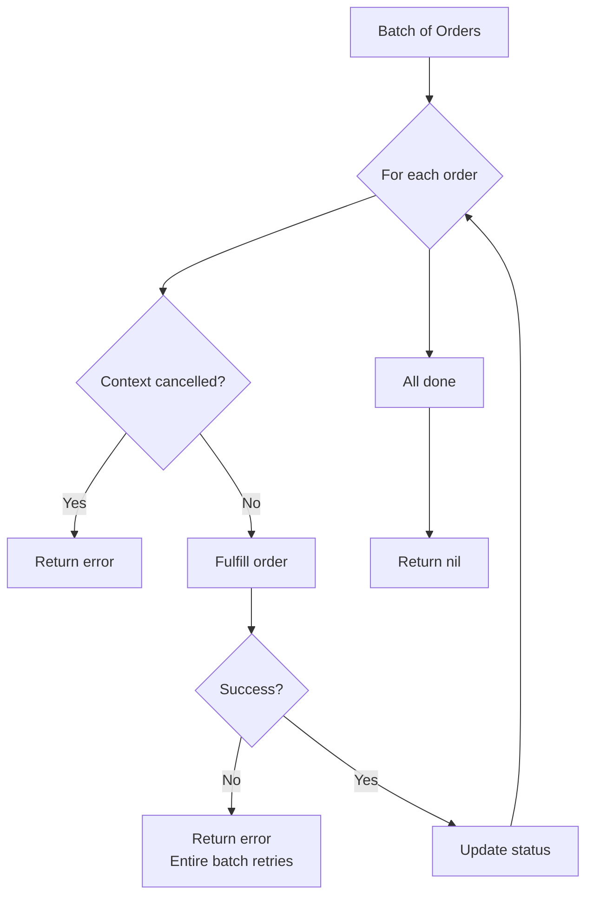

# Tutorial: Queue Processing

> **Quick Summary:** Add async order processing with type-safe queues and batch handling

## What You'll Build

Extend the orders API with asynchronous processing:

```
HTTP POST /orders
    ↓
Create order (sync)
    ↓
Enqueue for processing (async)
    ↓
Queue handler processes batch
    ↓
Update order status
```

**Time:** 20 minutes • **Difficulty:** Beginner

---

## Why Use Queues?

Queues enable:

- **Async processing** - Don't make users wait
- **Load leveling** - Handle traffic spikes
- **Retry logic** - Automatic retries on failure
- **Batch efficiency** - Process multiple items together
- **Decoupling** - HTTP and processing independent

**When to use:**
- Order fulfillment (this tutorial)
- Email sending
- Image processing
- Report generation
- Data synchronization

---

## Step 1: Start with REST API

If you completed the REST API tutorial, you have:

```go
// POST /orders creates an order
func createOrder(w http.ResponseWriter, r *http.Request) {
    // ... validation ...

    order := &Order{
        ID:     generateID(),
        Status: "pending",
        // ...
    }

    orders[order.ID] = order
    response.Created(w, order)
}
```

We'll add async processing after order creation.

---

## Step 2: Register Queue Handler

Add queue registration in `main()`:

```go
func main() {
    app := transire.New()

    // HTTP routes (existing)
    app.GET("/orders", listOrders)
    app.GET("/orders/{id}", getOrder)
    app.POST("/orders", createOrder(app))  // Pass app to closure

    // Queue handler (NEW)
    app.RegisterQueue("fulfill-orders", fulfillOrders)

    app.Run()
}
```

**Key points:**
- `"fulfill-orders"` is the queue key
- `fulfillOrders` is the handler function
- Handler signature: `func(ctx context.Context, orders []Order) error`

---

## Step 3: Implement Queue Handler

Add the handler function:

```go
import (
    "context"
    "log"
    "time"
)

// fulfillOrders processes orders asynchronously in batches
func fulfillOrders(ctx context.Context, orderBatch []Order) error {
    log.Printf("Processing batch of %d orders", len(orderBatch))

    for _, order := range orderBatch {
        // Check if context was cancelled
        if ctx.Err() != nil {
            log.Printf("Context cancelled, stopping batch")
            return ctx.Err()
        }

        log.Printf("Fulfilling order %s: %s", order.ID, order.Product)

        // Simulate fulfillment work
        if err := fulfillOrder(ctx, &order); err != nil {
            log.Printf("ERROR: Failed to fulfill order %s: %v", order.ID, err)
            return err // Will retry entire batch
        }

        // Update order status
        if storedOrder, exists := orders[order.ID]; exists {
            storedOrder.Status = "fulfilled"
            storedOrder.UpdatedAt = time.Now()
        }
    }

    log.Printf("Successfully processed %d orders", len(orderBatch))
    return nil
}

// fulfillOrder performs the actual fulfillment
func fulfillOrder(ctx context.Context, order *Order) error {
    // In production, this would:
    // - Reserve inventory
    // - Process payment
    // - Create shipping label
    // - Send confirmation email

    // Simulate work
    time.Sleep(100 * time.Millisecond)

    // Simulate occasional failure (10% of the time)
    if time.Now().UnixNano()%10 == 0 {
        return fmt.Errorf("payment processing failed")
    }

    return nil
}
```

**Handler flow:**



---

## Step 4: Enqueue from HTTP Handler

Modify `createOrder` to enqueue the order. Use a closure to give the handler access to the app:

```go
func createOrder(app *transire.App) http.HandlerFunc {
    return func(w http.ResponseWriter, r *http.Request) {
        var req CreateOrderRequest
        if err := json.NewDecoder(r.Body).Decode(&req); err != nil {
            response.BadRequest(w, "Invalid JSON: "+err.Error())
            return
        }

        if err := validateCreateOrder(&req); err != nil {
            response.BadRequest(w, err.Error())
            return
        }

        // Create order
        order := &Order{
            ID:        generateID(),
            Product:   req.Product,
            Quantity:  req.Quantity,
            Price:     req.Price,
            Status:    "pending", // Initially pending
            CreatedAt: time.Now(),
            UpdatedAt: time.Now(),
        }

        orders[order.ID] = order

        // Enqueue for async processing (NEW)
        if err := app.Enqueue(r.Context(), "fulfill-orders", *order); err != nil {
            log.Printf("WARNING: Failed to enqueue order %s: %v", order.ID, err)
            // Continue - order created, we can retry fulfillment later
        }

        w.Header().Set("Location", fmt.Sprintf("/orders/%s", order.ID))
        response.Created(w, order)
    }
}
```

**Note:** We use a closure pattern `func createOrder(app *transire.App) http.HandlerFunc` to give the handler access to the app instance for enqueueing messages.

**Important:** We enqueue *after* creating the order. If enqueue fails, the order still exists.

---

## Step 5: Test Locally

Start the server:

```bash
$ go run main.go
✓ Starting HTTP server on :8080
✓ Queue emulator: 1 queue (fulfill-orders), 1 worker
→ Ready: http://localhost:8080
```

Notice: "Queue emulator" confirms the queue is registered.

### Create an Order

```bash
$ curl -X POST http://localhost:8080/orders \
  -H "Content-Type: application/json" \
  -d '{
    "product": "Widget",
    "quantity": 5,
    "price": 99.99
  }'

{
  "id": "ORD-1699999999",
  "product": "Widget",
  "quantity": 5,
  "price": 99.99,
  "status": "pending",
  ...
}
```

### Check Server Logs

You should see:

```
Processing batch of 1 orders
Fulfilling order ORD-1699999999: Widget
Successfully processed 1 orders
```

### Verify Status Changed

```bash
$ curl http://localhost:8080/orders/ORD-1699999999

{
  "id": "ORD-1699999999",
  "status": "fulfilled",  # Changed from "pending"!
  ...
}
```

---

## Step 6: Handle Batch Errors

The current implementation follows the **simple error pattern**: if one order fails, return an error and the entire batch is retried. This is the recommended approach for most use cases.

**Why this works:**
- **Simple and reliable** - Easy to understand and maintain
- **Automatic retry** - Framework handles all retry logic
- **DLQ support** - After max retries, failed messages move to dead-letter queue
- **Idempotent design** - Orders can be safely reprocessed

**Alternative: Best-effort processing** (skip failures):

```go
func fulfillOrders(ctx context.Context, orderBatch []Order) error {
    log.Printf("Processing batch of %d orders", len(orderBatch))

    for _, order := range orderBatch {
        if ctx.Err() != nil {
            break // Stop on cancellation
        }

        log.Printf("Fulfilling order %s: %s", order.ID, order.Product)

        if err := fulfillOrder(ctx, &order); err != nil {
            // Log but don't fail batch - this order is lost
            log.Printf("ERROR: Failed to fulfill order %s: %v", order.ID, err)
            continue // Skip to next order
        }

        // Update status on success
        if storedOrder, exists := orders[order.ID]; exists {
            storedOrder.Status = "fulfilled"
            storedOrder.UpdatedAt = time.Now()
        }
    }

    // Always return nil - all messages acknowledged
    return nil
}
```

**Use best-effort when:**
- Orders are independent
- Occasional failures are acceptable
- You have monitoring/alerting for errors

**Note:** The simple fail-fast pattern (returning error immediately) is recommended for most applications.

---

## Step 7: Configure Queue Settings

Add queue configuration in `transire.yaml`:

```yaml
version: 1
service: orders-api
runtime: go
cloud: aws

queues:
  max_batch_size: 10          # Process up to 10 orders at once
  batch_window_s: 5           # Wait 5s to collect batch
  visibility_timeout_s: 30    # Hide message for 30s while processing
  max_receive_count: 3        # Retry 3 times before DLQ

observability:
  logging:
    level: info
    format: json
```

**Configuration explained:**

| Setting | Purpose |
|---------|---------|
| `max_batch_size` | How many messages to process together |
| `batch_window_s` | How long to wait for more messages |
| `visibility_timeout_s` | Processing time before message visible again |
| `max_receive_count` | Retries before moving to DLQ |

---

## Understanding Queues: Local vs Cloud

### Local Mode (Development)

```bash
$ transire run
```

**What happens:**
- In-memory queue
- 1 worker per queue (default)
- Messages processed immediately
- No actual SQS

**Good for:**
- Development
- Testing
- Fast iteration

### Cloud Mode (Production)

```bash
$ transire deploy
```

**What happens:**
- AWS SQS queue created
- Lambda triggered by batch
- DLQ created automatically
- Retries with exponential backoff

**Good for:**
- Production
- Scaling
- Durability

---

## Type Safety in Queues

Transire ensures type safety at both build time and runtime:

### Build Time

`transire gen` validates:

```go
// ✅ Correct: Handler expects []Order
app.RegisterQueue("orders", func(ctx context.Context, orders []Order) error {
    return nil
})

// ❌ Error E1002: Invalid signature
app.RegisterQueue("orders", func(ctx context.Context, orders []string) error {
    return nil
})
```

### Runtime

Each message includes `__type` field:

```json
{
  "__type": "main.Order",
  "id": "ORD-123",
  "product": "Widget"
}
```

If type doesn't match, message goes to DLQ.

---

## Common Patterns

### Pattern 1: Conditional Processing

```go
func processOrders(ctx context.Context, orders []Order) error {
    for _, order := range orders {
        // Skip if already processed
        if order.Status == "fulfilled" {
            log.Printf("Order %s already fulfilled, skipping", order.ID)
            continue
        }

        // Process only unfulfilled orders
        fulfillOrder(ctx, &order)
    }
    return nil
}
```

### Pattern 2: External API Calls

```go
func processOrders(ctx context.Context, orders []Order) error {
    for _, order := range orders {
        // Call external API with timeout
        ctx, cancel := context.WithTimeout(ctx, 10*time.Second)
        defer cancel()

        if err := paymentAPI.Charge(ctx, order); err != nil {
            log.Printf("Payment failed: %v", err)
            return err
        }
    }
    return nil
}
```

### Pattern 3: Batch Database Operations

```go
func processOrders(ctx context.Context, orders []Order) error {
    // Collect all order IDs
    ids := make([]string, len(orders))
    for i, order := range orders {
        ids[i] = order.ID
    }

    // Single database query
    return db.UpdateOrderStatus(ctx, ids, "fulfilled")
}
```

---

## Troubleshooting

### Queue Not Processing

**Issue:** Orders created but never fulfilled.

**Check:**
1. Is queue registered?
   ```go
   app.RegisterQueue("fulfill-orders", handler)
   ```

2. Are messages being enqueued?
   ```go
   log.Printf("Enqueuing order: %v", err) // Add logging
   ```

3. Is handler being called?
   ```go
   func handler(...) {
       log.Println("Handler invoked") // Add at start
   }
   ```

### Messages Going to DLQ

**Issue:** All messages end up in dead-letter queue.

**Causes:**
- Handler returning errors
- Timeout exceeded
- Type mismatch

**Solution:**
Check Lambda logs (cloud) or console output (local):

```bash
# Local
$ transire run  # Watch console output

# Cloud
$ aws logs tail /aws/lambda/app-queue-handler --follow
```

### Slow Processing

**Issue:** Queue processing is slow.

**Solutions:**

1. **Increase batch size:**
   ```yaml
   queues:
     max_batch_size: 50  # Process more at once
   ```

2. **Reduce batch window:**
   ```yaml
   queues:
     batch_window_s: 1  # Don't wait as long
   ```

3. **Optimize handler:**
   ```go
   // Use goroutines for parallel processing
   var wg sync.WaitGroup
   for _, order := range orders {
       wg.Add(1)
       go func(o Order) {
           defer wg.Done()
           process(o)
       }(order)
   }
   wg.Wait()
   ```

---

## Complete Code

Here's the complete implementation:

```go
package main

import (
    "context"
    "encoding/json"
    "fmt"
    "log"
    "net/http"
    "time"

    "github.com/transire/sdk-go"
    "github.com/transire/sdk-go/response"
)

func main() {
    app := transire.New()

    // HTTP routes
    app.GET("/orders", listOrders)
    app.GET("/orders/{id}", getOrder)
    app.POST("/orders", createOrder)

    // Queue handler
    app.RegisterQueue("fulfill-orders", fulfillOrders)

    app.Run()
}

type Order struct {
    ID        string    `json:"id"`
    Product   string    `json:"product"`
    Quantity  int       `json:"quantity"`
    Price     float64   `json:"price"`
    Status    string    `json:"status"`
    CreatedAt time.Time `json:"created_at"`
    UpdatedAt time.Time `json:"updated_at"`
}

type CreateOrderRequest struct {
    Product  string  `json:"product"`
    Quantity int     `json:"quantity"`
    Price    float64 `json:"price"`
}

var orders = make(map[string]*Order)

func createOrder(w http.ResponseWriter, r *http.Request) {
    var req CreateOrderRequest
    if err := json.NewDecoder(r.Body).Decode(&req); err != nil {
        response.BadRequest(w, "Invalid JSON")
        return
    }

    order := &Order{
        ID:        generateID(),
        Product:   req.Product,
        Quantity:  req.Quantity,
        Price:     req.Price,
        Status:    "pending",
        CreatedAt: time.Now(),
        UpdatedAt: time.Now(),
    }

    orders[order.ID] = order

    // Enqueue for async processing
    if err := app.Enqueue(r.Context(), "fulfill-orders", *order); err != nil {
        log.Printf("WARNING: Failed to enqueue: %v", err)
    }

    response.Created(w, order)
}

func fulfillOrders(ctx context.Context, orderBatch []Order) error {
    log.Printf("Processing batch of %d orders", len(orderBatch))

    br := transire.NewBatchResult(len(orderBatch))

    for i, order := range orderBatch {
        if ctx.Err() != nil {
            for j := i; j < len(orderBatch); j++ {
                br.Fail(j, ctx.Err())
            }
            break
        }

        log.Printf("Fulfilling order %s", order.ID)

        if err := fulfillOrder(ctx, &order); err != nil {
            log.Printf("ERROR: %v", err)
            br.Fail(i, err)
            continue
        }

        if storedOrder, exists := orders[order.ID]; exists {
            storedOrder.Status = "fulfilled"
            storedOrder.UpdatedAt = time.Now()
        }
    }

    log.Printf("Complete: %d succeeded, %d failed",
        br.SuccessCount(), br.FailureCount())

    // Return error if any failures
    if br.HasFailures() {
        return fmt.Errorf("batch had %d failures", br.FailureCount())
    }

    return nil
}

func fulfillOrder(ctx context.Context, order *Order) error {
    time.Sleep(100 * time.Millisecond)
    return nil
}

func generateID() string {
    return fmt.Sprintf("ORD-%d", time.Now().UnixNano())
}

// ... other handlers (listOrders, getOrder) ...
```

---

## What You Learned

Congratulations! You've implemented async queue processing. You now know:

- ✅ How to register queue handlers
- ✅ How to enqueue messages from HTTP handlers
- ✅ How to process messages in batches
- ✅ How to handle partial batch failures
- ✅ How to configure queue settings
- ✅ Type-safe message processing
- ✅ Local vs cloud queue differences
- ✅ Troubleshooting queue issues

---

## Next Steps

### Add Scheduled Jobs

Continue to [Scheduled Jobs Tutorial →](04-scheduled-jobs.md) to learn how to run periodic tasks like daily reports.

### Enhance Error Handling

```go
// Add retry with exponential backoff
func fulfillOrder(ctx context.Context, order *Order) error {
    maxRetries := 3
    for i := 0; i < maxRetries; i++ {
        if err := attempt(ctx, order); err == nil {
            return nil
        }
        time.Sleep(time.Duration(1<<i) * time.Second) // 1s, 2s, 4s
    }
    return fmt.Errorf("failed after %d retries", maxRetries)
}
```

### Monitor Queue Metrics

```go
func fulfillOrders(ctx context.Context, orders []Order) error {
    start := time.Now()
    defer func() {
        metrics.RecordQueueProcessing(time.Since(start), len(orders))
    }()
    // ... process orders ...
}
```

---

## See Also

- [Queue API Reference](../../reference/sdk/queue-api/) - Complete queue documentation
- [Error Handling Guide](../../guides/patterns/error-handling/) - Production error patterns
- [Idempotency Guide](../../guides/idempotency/) - Safe retries
- [AWS SQS Details](../../plugins/cloud/aws/queues/) - How queues work in AWS
- [Troubleshooting Queues](../../guides/troubleshooting/queue-issues/) - Common problems
