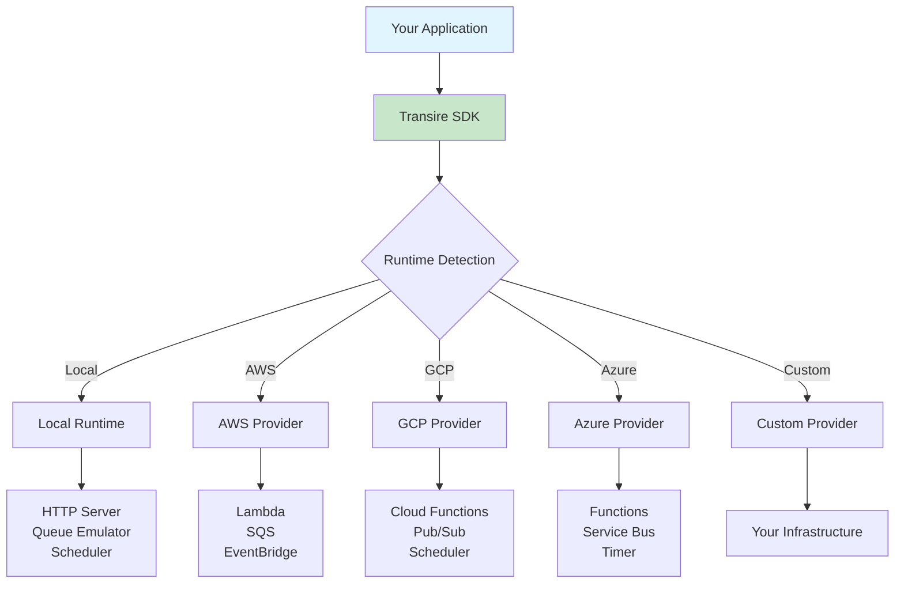

# Cloud Provider Plugin System

> **Quick Summary:** Transire's pluggable architecture lets you deploy to any cloud provider

## Overview

Transire uses a **pluggable provider system** where cloud-specific implementations are separate from the core framework. This means:

- ✅ **Cloud-agnostic core** - Write once, deploy anywhere
- ✅ **Provider flexibility** - Switch clouds without code changes
- ✅ **Extensibility** - Create custom providers for your infrastructure
- ✅ **Community ecosystem** - Third-party providers available

---

## Architecture



**Key insight:** Your application code remains the same. Only the runtime changes.

---

## How It Works

### 1. Automatic Detection

The SDK automatically detects which cloud provider is running:

```go
// Your code - no provider imports needed
func main() {
    app := transire.New()
    app.GET("/hello", handler)
    app.Run()
}
```

**Detection logic:**

| Environment | Detection Method |
|-------------|------------------|
| **Local** | Default when no cloud detected |
| **AWS Lambda** | `AWS_LAMBDA_FUNCTION_NAME` env var |
| **GCP Functions** | `FUNCTION_TARGET` env var |
| **Azure Functions** | `AZURE_FUNCTIONS_ENVIRONMENT` env var |

### 2. Provider Contract

All providers implement the same interface:

```go
type CloudProvider interface {
    // Runtime detection
    IsRunningInCloud() bool

    // HTTP handling
    AdaptHTTPEvent(cloudEvent interface{}) (*HTTPRequest, error)
    AdaptHTTPResponse(resp *HTTPResponse) interface{}

    // Queue handling
    AdaptQueueEvent(cloudEvent interface{}) ([]Message, error)
    ReportPartialBatchFailure(failures []int) interface{}

    // Schedule handling
    AdaptScheduleEvent(cloudEvent interface{}) error

    // Deployment
    PackageHandler(manifest *Manifest) ([]Artifact, error)
    GenerateInfrastructure(manifest *Manifest) (string, error)
}
```

**Contract guarantees:**
- Same behavior across clouds
- Predictable error handling
- Consistent logging format

### 3. Local Emulation

Local mode provides a **development-friendly runtime**:

```go
// Local mode automatically used during development
$ transire run

✓ HTTP server on :8080
✓ Queue emulator: 1 worker
✓ Scheduler: next run in 1h
→ Ready
```

**Local features:**
- In-memory queue
- Fixed-rate scheduler
- Hot reload support
- No cloud credentials needed

---

## Available Providers

### AWS (Official)

**Status:** ✅ Production-ready

**Services:**
- **HTTP:** API Gateway v2 (HTTP API) → Lambda
- **Queues:** SQS → Lambda (batch invocation)
- **Schedules:** EventBridge → Lambda

**[Documentation →](aws/)**

**Configuration:**

```yaml
# transire.yaml
cloud: aws

deploy:
  arch: arm64           # ARM64 (Graviton) for cost savings
  memory_mb: 256        # 256 MB default
  timeout_s: 30         # 30 second timeout
```

---

### GCP (Planned)

**Status:** 🚧 Planned for Q2 2026

**Services:**
- **HTTP:** API Gateway → Cloud Functions
- **Queues:** Pub/Sub → Cloud Functions
- **Schedules:** Cloud Scheduler → Cloud Functions

**[Track Progress →](https://github.com/transire/transire/issues/123)**

---

### Azure (Planned)

**Status:** 🚧 Planned for Q3 2026

**Services:**
- **HTTP:** API Management → Functions
- **Queues:** Service Bus → Functions
- **Schedules:** Timer Triggers → Functions

**[Track Progress →](https://github.com/transire/transire/issues/124)**

---

### Custom Providers

**Status:** ✅ Extensible

Create custom providers for:
- On-premises infrastructure
- Hybrid cloud setups
- Proprietary platforms
- Development/testing environments

**[Creating Custom Providers →](*Guide coming soon*)**

---

## Provider Selection

### Configuration-Based

Specify provider in `transire.yaml`:

```yaml
cloud: aws  # or gcp, azure, custom
```

### Automatic Detection

If not specified, Transire detects the cloud automatically:

```go
// No configuration needed
// Detects AWS, GCP, Azure, or runs local
app.Run()
```

### Explicit Override

Override for testing:

```bash
# Force local mode
TRANSIRE_RUNTIME=local go run main.go

# Force AWS mode (for testing locally)
TRANSIRE_RUNTIME=aws go run main.go
```

---

## Provider Comparison

| Feature | Local | AWS | GCP | Azure |
|---------|-------|-----|-----|-------|
| **HTTP** | Chi server | API Gateway v2 | API Gateway | API Management |
| **Queues** | In-memory | SQS | Pub/Sub | Service Bus |
| **Schedules** | Fixed-rate | EventBridge | Cloud Scheduler | Timer |
| **Scaling** | Single process | Auto-scaling | Auto-scaling | Auto-scaling |
| **Cold start** | None | ~100ms | ~200ms | ~150ms |
| **Cost** | Free | Pay per use | Pay per use | Pay per use |
| **Setup** | `transire run` | `transire deploy` | `transire deploy` | `transire deploy` |

---

## Provider Responsibilities

### What Providers Handle

1. **Event Adaptation**
   - Convert cloud events → Transire types
   - Convert Transire responses → cloud events

2. **Deployment**
   - Package handlers for cloud runtime
   - Generate infrastructure code
   - Create IAM/permissions

3. **Configuration**
   - Parse provider-specific config
   - Set environment variables
   - Configure logging/tracing

### What Providers DON'T Handle

- ❌ Business logic (your code)
- ❌ Routing (handled by Chi)
- ❌ Middleware (SDK responsibility)
- ❌ Dependency injection (SDK responsibility)

---

## Example: HTTP Request Flow

### Local Mode

```
1. HTTP Request → Chi Router
2. Chi Router → Your Handler
3. Your Handler → HTTP Response
```

### Cloud Mode (AWS)

```
1. HTTP Request → API Gateway
2. API Gateway → Lambda (invoke)
3. Lambda → AWS Provider (adapt event)
4. AWS Provider → Transire SDK
5. Transire SDK → Chi Router
6. Chi Router → Your Handler
7. Your Handler → HTTP Response
8. HTTP Response → Transire SDK
9. Transire SDK → AWS Provider (adapt response)
10. AWS Provider → API Gateway
11. API Gateway → HTTP Response
```

**Key point:** Steps 6-7 are identical in both modes. Your code doesn't change.

---

## Configuration

### Provider-Specific Settings

```yaml
# transire.yaml
cloud: aws

# Provider-specific configuration
aws:
  region: us-east-1
  account_id: "123456789012"

  # Lambda configuration
  lambda:
    arch: arm64
    memory_mb: 256
    timeout_s: 30
    runtime: provided.al2023

  # API Gateway configuration
  api_gateway:
    type: http  # or rest
    cors:
      enabled: true
      allow_origins: ["*"]

  # SQS configuration
  sqs:
    visibility_timeout_s: 30
    max_receive_count: 3
    message_retention_s: 345600  # 4 days

  # EventBridge configuration
  eventbridge:
    enabled: true
```

**[See AWS Config Reference →](aws/configuration/)**

---

## Switching Providers

### Zero Code Changes

```go
// This code works on ANY provider
func main() {
    app := transire.New()
    app.GET("/hello", handler)
    app.Run()
}
```

### Configuration Only

```yaml
# Deploy to AWS
cloud: aws

# Switch to GCP (when available)
# cloud: gcp

# Switch to Azure (when available)
# cloud: azure
```

### Redeploy

```bash
$ transire deploy
# Automatically deploys to configured provider
```

---

## Provider Development

### Creating a Custom Provider

1. **Implement the interface:**

```go
package myprovider

type MyProvider struct{}

func (p *MyProvider) IsRunningInCloud() bool {
    return os.Getenv("MY_CLOUD_ENV") != ""
}

func (p *MyProvider) AdaptHTTPEvent(event interface{}) (*HTTPRequest, error) {
    // Convert your cloud's HTTP event format
}

// ... implement other methods
```

2. **Register the provider:**

```go
import "github.com/transire/sdk-go/providers"

func init() {
    providers.Register("mycloud", &MyProvider{})
}
```

3. **Use in configuration:**

```yaml
cloud: mycloud
```

**[Full Guide →](*Guide coming soon*)**

---

## Best Practices

### 1. Don't Import Providers in App Code

```go
// ❌ Bad: Importing provider
import _ "github.com/transire/cloud-aws"

func main() {
    app := transire.New()
    // ...
}

// ✅ Good: No provider imports
func main() {
    app := transire.New()
    // ...
}
```

**Why?** The CLI includes all official providers. Your app stays cloud-agnostic.

### 2. Test with Local Mode

```bash
# Always test locally first
$ transire run
$ curl http://localhost:8080/endpoint

# Then deploy
$ transire deploy
```

### 3. Use Provider-Agnostic Code

```go
// ✅ Good: Works everywhere
app.Enqueue(ctx, "queue-key", message)

// ❌ Bad: AWS-specific
sqsClient.SendMessage(&sqs.SendMessageInput{...})
```

### 4. Handle Provider Limitations

Different providers have different limits:

```go
// Check message size before enqueuing
if len(data) > 256*1024 {
    // AWS SQS limit is 256 KB
    return fmt.Errorf("message too large")
}
```

**[See Provider Limits →](aws/limits/)**

---

## Troubleshooting

### Provider Not Detected

**Issue:** App runs in local mode when it should use cloud provider.

**Check:**
1. Environment variables set correctly?
2. Provider registered in CLI?
3. Configuration file correct?

```bash
# Debug provider detection
TRANSIRE_DEBUG=true transire deploy
```

### Deployment Fails

**Issue:** `transire deploy` fails with provider error.

**Solutions:**
1. Verify cloud credentials
2. Check provider-specific requirements
3. Review generated infrastructure

```bash
# See generated infrastructure
$ transire gen
$ cat infra/resources/*.tf
```

### Behavior Differs Between Local and Cloud

**Issue:** Works locally but fails in cloud.

**Check:**
1. Environment variables
2. File paths (use `/tmp` in cloud)
3. Timeouts (cloud has hard limits)
4. Memory limits

**[See Parity Guide →](../../guides/local-vs-cloud/)**

---

## Provider Ecosystem

### Official Providers

Maintained by Transire team:
- **AWS** - Production-ready
- **GCP** - Planned Q2 2026
- **Azure** - Planned Q3 2026

### Community Providers

Third-party providers (when available):
- **DigitalOcean Functions**
- **Cloudflare Workers**
- **Custom Kubernetes**

**[Browse Community Providers →](https://github.com/transire/providers)**

---

## Contributing

Want to add support for your cloud?

1. **Check if planned:** [Provider Roadmap](https://github.com/transire/transire/issues?q=label%3Aprovider)
2. **Read the guide:** [Creating Providers](*Guide coming soon*)
3. **Submit PR:** Follow [Contributing Guidelines](../../community/contributing/)

---

## See Also

- [AWS Provider Documentation](aws/) - Complete AWS reference
- [Creating Custom Providers](*Guide coming soon*) - Build your own
- [IaC Providers](../iac/overview/) - Infrastructure as code plugins
- [CI Providers](../ci/overview/) - CI/CD plugins
- [Local vs Cloud Guide](../../guides/local-vs-cloud/) - Understanding differences
